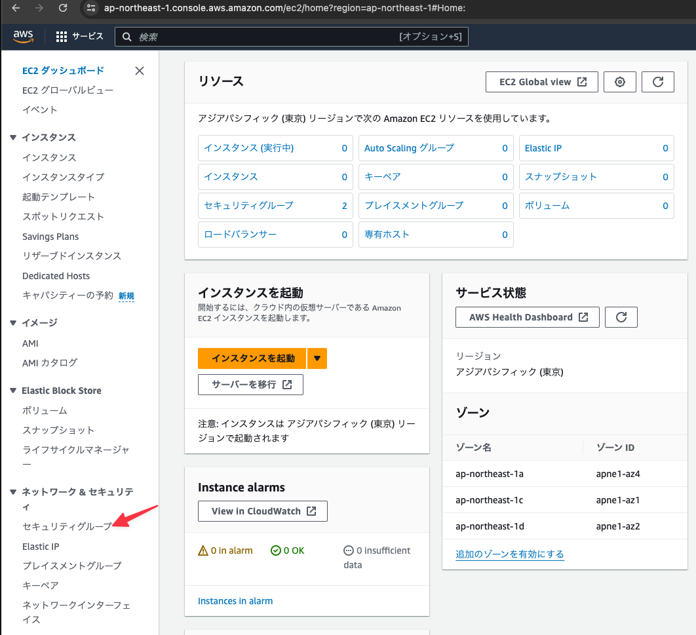
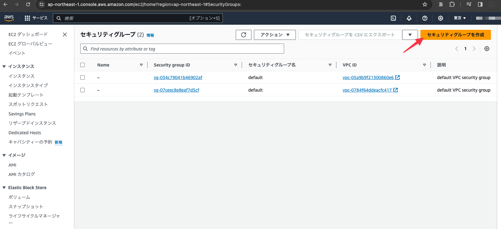
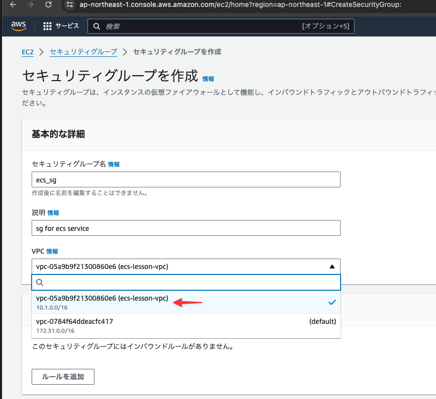
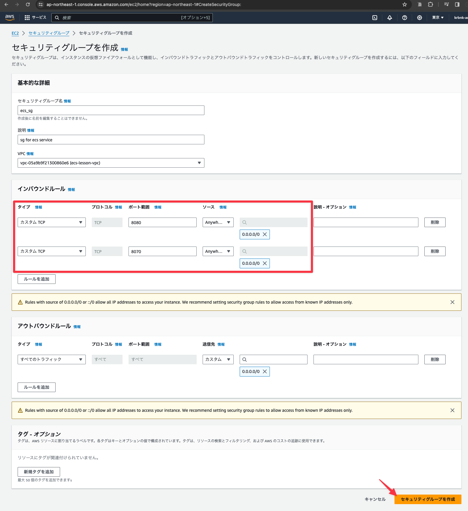
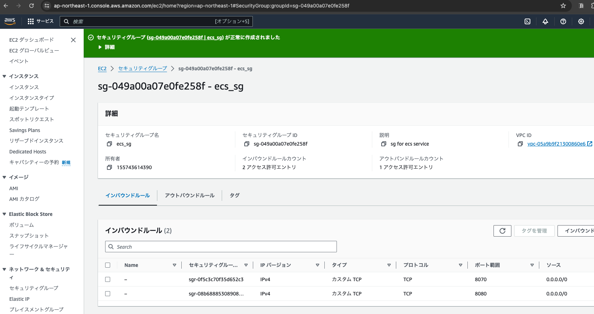
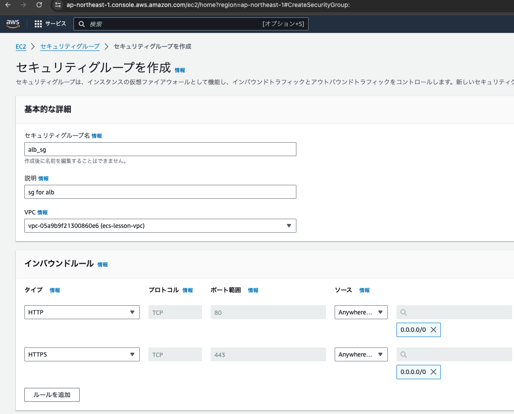
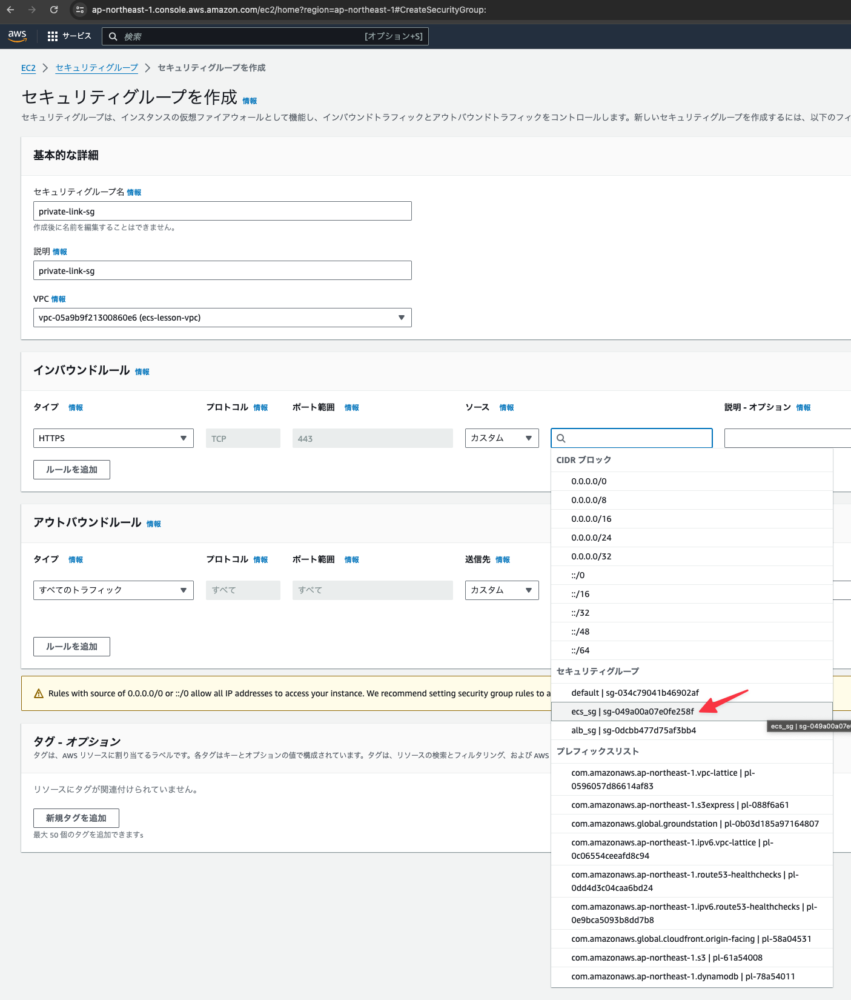

## EC2のサービス画面を開きセキュリティグループを選択する

## 「セキュリティグループを作成」ボタンをクリックする

## 「基本的な詳細」を設定する

- セキュリティグループ名および説明は適当な値を設定する
- VPCは(default)ではない方(IPが10.1.0.0/16)を選択 ※ CloudFormationで作成したVPC

## インバウンドルールを設定し「セキュリティグループを作成」ボタンをクリックする

- ポート8080と8070に対してソース`0.0.0.0/0`を追加する(どこからでもアクセス可能とする)

## セキュリティグループが正常に作成されたことを確認

   

## さらにセキュリティグループを作成する (for alb)

- 下記の内容で作成する

## さらにセキュリティグループを作成する (for private link)

- 下記の内容で作成する
- ソースにはすでに作成した`ecs-sg`を選択すること

