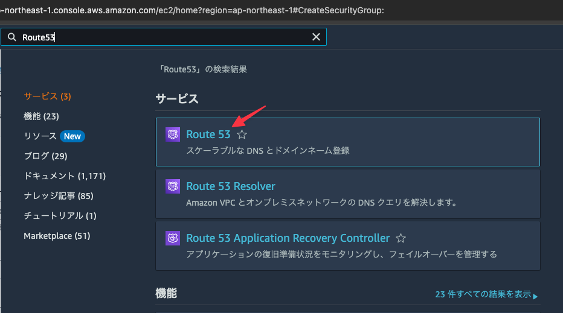
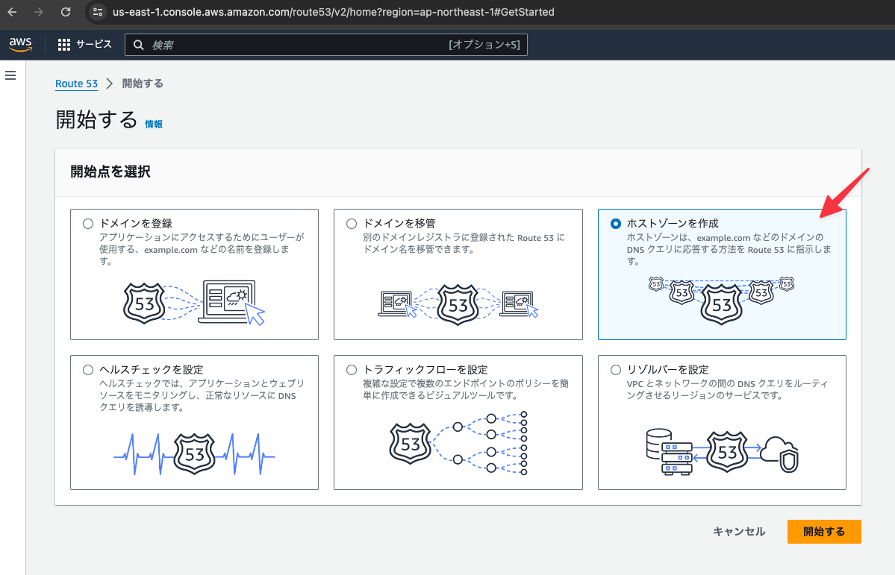
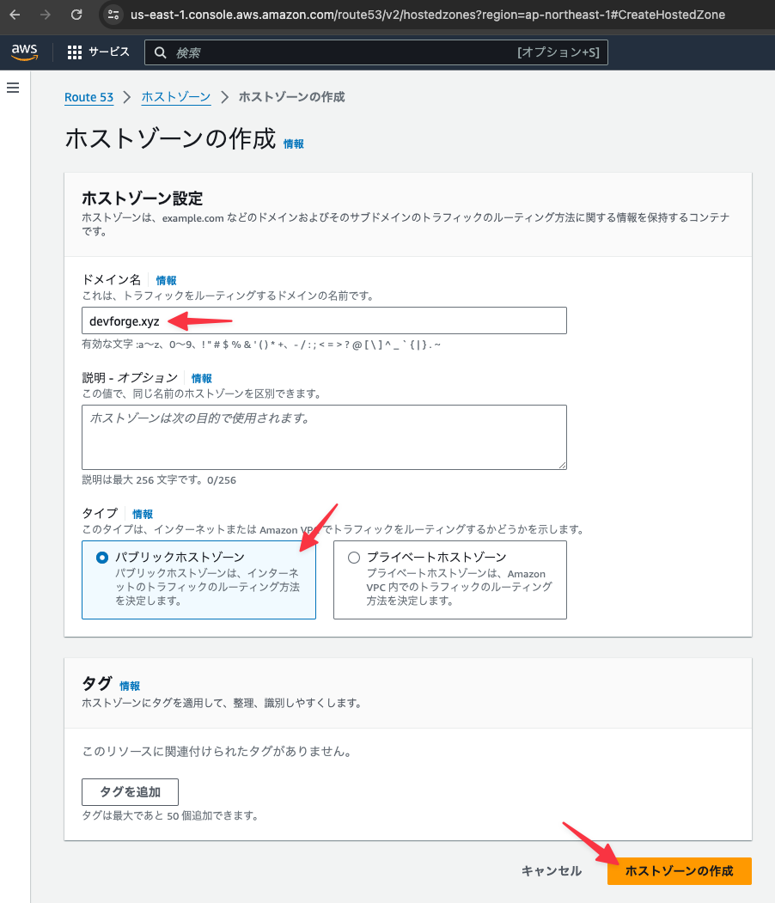
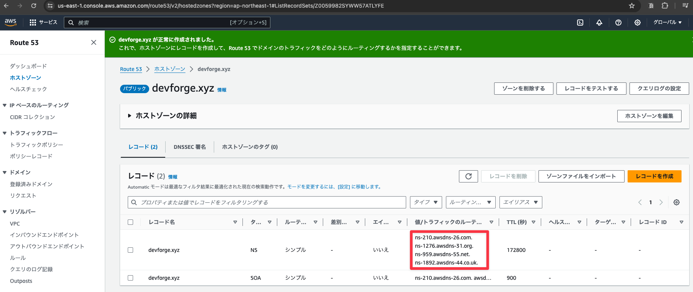
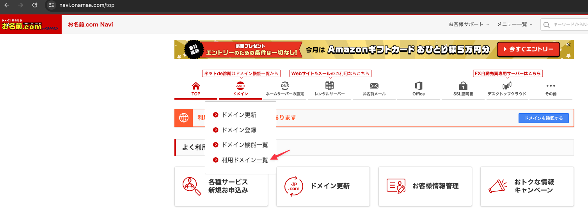
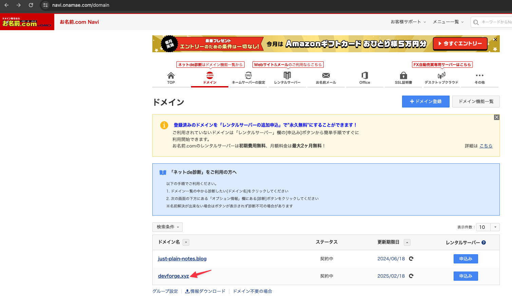
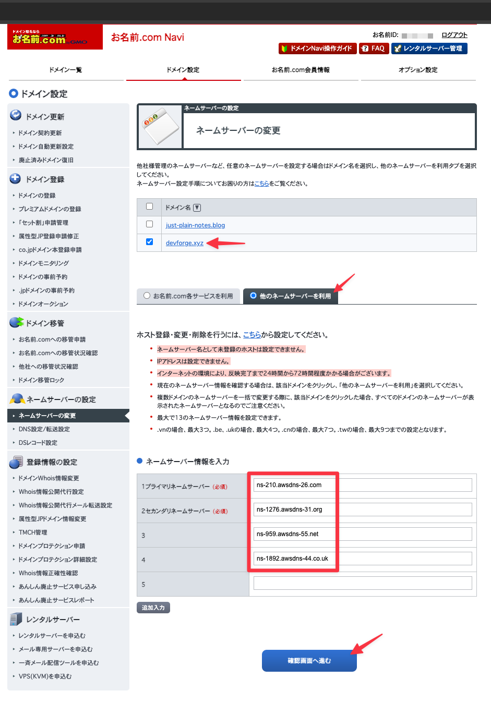
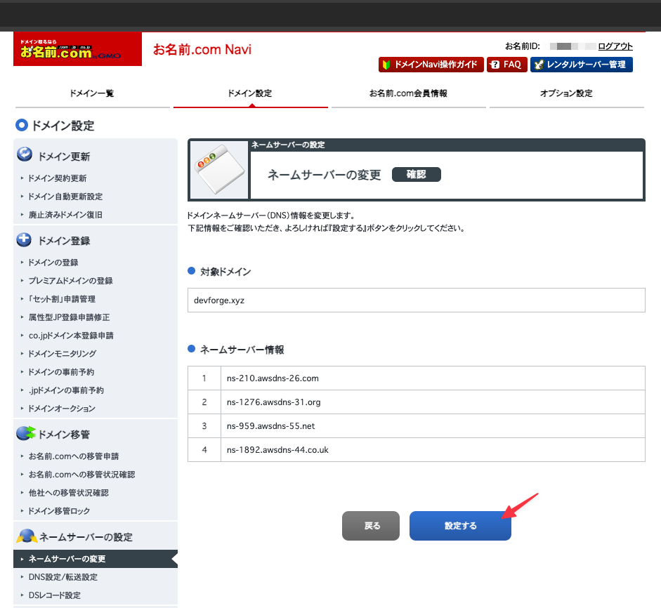
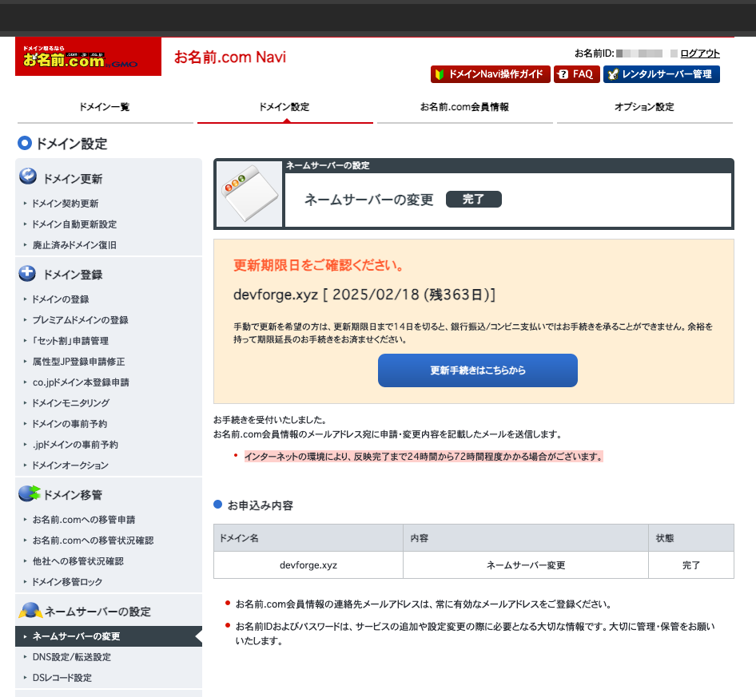

# ネームサーバーを設定する

## サービスから「Route53」を選択しクリックする

## 「開始する」ボタンをクリックする

## 「ホストゾーンを作成」を選択し、「開始する」ボタンをクリックする

## 下記の内容を設定し「ホストゾーンの作成」ボタンをクリックする

- ドメイン名に取得したドメイン名を設定する
- パブリックホストゾーンを選択する

## ホストゾーンの作成後、ネームサーバーの一覧を確認する

- 下記のネームサーバーの一覧をこの後でお名前.comに設定する

## TOP画面の「ドメイン」メニューより「利用ドメイン一覧」を選択する

## ドメイン一覧から今回使用するドメインをクリックする

## 下記の内容を設定し、「確認画面へ進む」ボタンをクリックする

- ドメイン名の一覧で今回使用するドメイン名のチェックをON
- 「他のネームサーバーを利用」を選択し、先ほどのRoute53のホストゾーンの作成で確認したネームサーバーを設定する

## 「設定する」ボタンをクリックする

## ネームサーバーの変更を確認する

