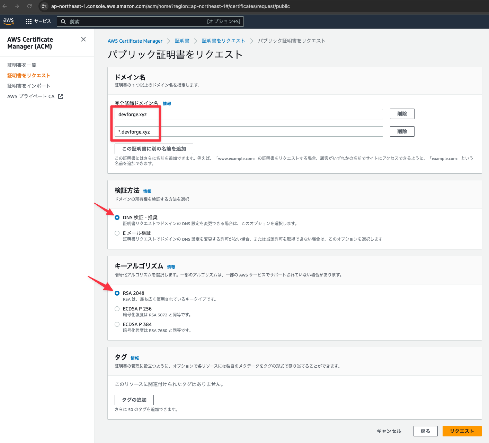

# 証明書を取得する

## サービスから「Certificate Manager」を選択する

## 「証明書をリクエスト」をクリックする

## 下記内容を設定し「次へ」をクリックする

- 「パブリック証明書をリクエスト」を選択

## 下記の内容を設定し「リクエスト」をクリックする

- ドメイン名に
  - devforge.xyz
  - *.devforge.xyz
- 検証方法: DNS検証
- キーアルゴリズム: RSA 2048

## 証明書の一覧から先ほど作成した証明書をクリックする

## 「Route 53でレコードを作成」をクリックする

## 「レコードを作成」をクリックする

## DNSレコードが正常に作成されたことを確認する

- ※ ステータスが「保留中の検証」になっているが数分待つと検証が完了する

## 作成したRoute53レコードを確認する

### Route53のダッシュボードから「ホストゾーン」をクリックする

### 登録したドメイン名をクリックする

### CNAMEレコードが追加されていることを確認する

## 証明書のステータスが発行済みになっていることを確認する

