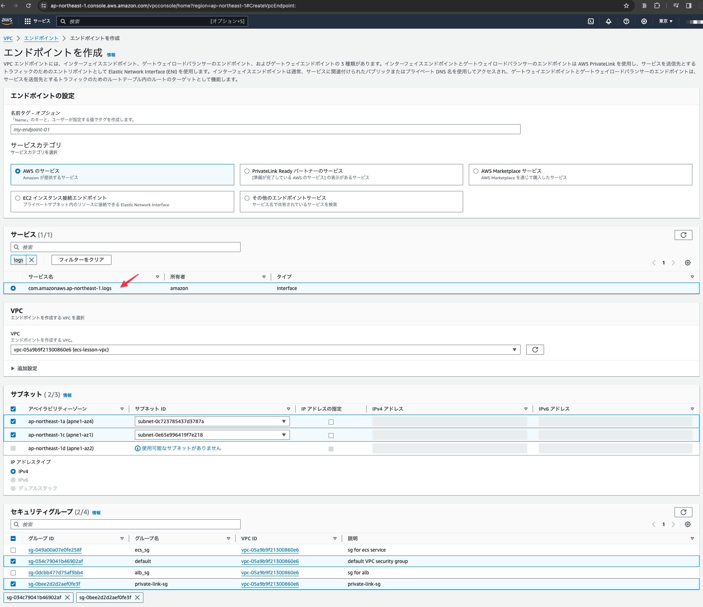

# VPCエンドポイントの作成

※作成したVPCは未使用の状態でも課金が発生するので注意

## VPCサービスのメニューから「エンドポイント」をクリックする

## 「エンドポイントを作成」をクリックする

## 下記の内容を設定する

- 「サービス」に`ecr`を入力
- 絞り込まれた一覧から`dkr`で終わっているサービスを選択する
- 「サブネット」には上から`Private Subnet1`、`Private Subnet2`をそれぞれ選択する
- 「セキュリティグループ」には`default`と`private-link-sg`をチェックする

## 画面最下部の「エンドポイントを作成」ボタンをクリックする

## エンドポイントが作成されたことを確認する

## 続いて`ecr.api`のエンドポイントを作成する

※以降、選択する「サービス」のみを変更し、その他の項目は上述の内容と同じ値を設定する

## 続いて`secretsmanager`のエンドポイントを作成する

## 続いて`ssm`のエンドポイントを作成する

## 続いて`logs`のエンドポイントを作成する

## 続いて`s3`のエンドポイントを作成する

ここではこれまでとは入力内容が異なることに注意。

- 「タイプ」が`Gateway`であるものを選択する
- 「ルートテーブル」は全てをチェックする

## 全てのエンドポイントが作成されたことを確認する

