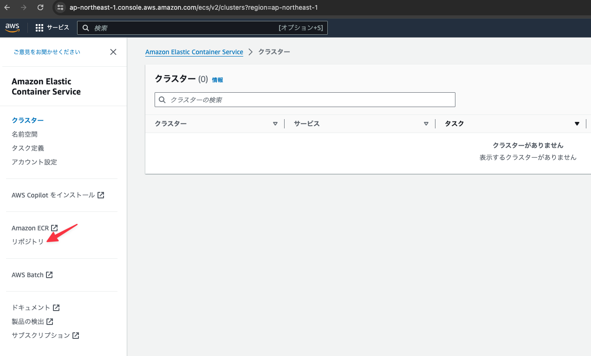

# ECRリポジトリの作成

## Elastic Container Serviceを選択する


## メニューからリポジトリを選択する



## プライベートリポジトリを選択する


## 「リポジトリを作成」ボタンをクリックする


## 下記の内容を設定して「リポジトリを作成」ボタンをクリックする


## さらに下記の内容を設定して「リポジトリを作成」ボタンをクリックする


## 下記の内容を設定して「リポジトリを作成」ボタンをクリックする


## 作成したリポジトリの一覧を確認する

この後に使用するコマンドを控えておくために作成したリポジトリを選択する
(ここでは先頭のecs-sample-backendを選択)


## 「プッシュコマンドの表示」ボタンをクリックする


## 表示されているコマンドをメモしておく


### 1

```
aws ecr get-login-password --region ap-northeast-1 | docker login --username AWS --password-stdin 155743614390.dkr.ecr.ap-northeast-1.amazonaws.com
```

### 2

```
docker build -t ecs-sample-backend .
```

### 3

```
docker tag ecs-sample-backend:latest 155743614390.dkr.ecr.ap-northeast-1.amazonaws.com/ecs-sample-backend:latest
``` 

### 4

```
docker push 155743614390.dkr.ecr.ap-northeast-1.amazonaws.com/ecs-sample-backend:latest
```