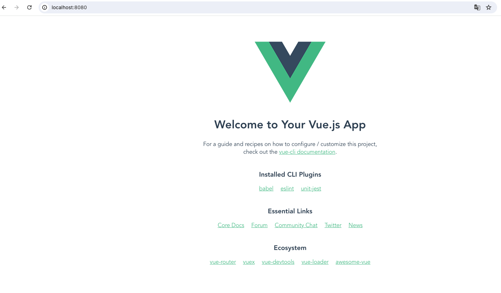
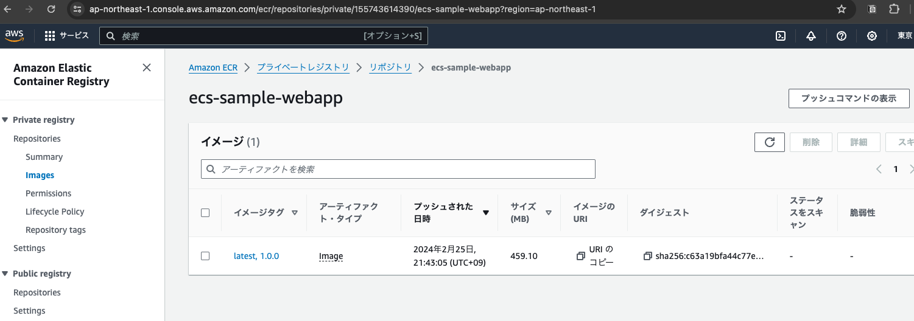

# Dockerイメージの作成

frontend/backend/restapiそれぞれについてのDockerイメージを作成していく

## frontendイメージの作成

### Vueプロジェクトの作成

下記コマンドを実行してvueのプロジェクトを作成する

```
npx @vue/cli create sample-webapp
```

### Manually select featuresを選択する

```
Vue CLI v5.0.8
? Please pick a preset: (Use arrow keys)
❯ Default ([Vue 3] babel, eslint) 
  Default ([Vue 2] babel, eslint) 
  Manually select features 
```

### 下記のチェックを入れてさらに進める

```
Vue CLI v5.0.8
? Please pick a preset: Manually select features
? Check the features needed for your project: (Press <space> to select, <a> to toggle all, <i> to invert selection, and <enter> to proceed)
 ◉ Babel
 ◯ TypeScript
 ◯ Progressive Web App (PWA) Support
 ◯ Router
 ◯ Vuex
 ◯ CSS Pre-processors
 ◉ Linter / Formatter
❯◉ Unit Testing
 ◯ E2E Testing
 ```

 ### Version 3.xを選択する

 ```
Vue CLI v5.0.8
? Please pick a preset: Manually select features
? Check the features needed for your project: Babel, Linter, Unit
? Choose a version of Vue.js that you want to start the project with (Use arrow keys)
❯ 3.x 
  2.x 
 ```

### ESLint設定を設定する

先頭の項目を選択する

```
? Please pick a preset: Manually select features
? Check the features needed for your project: Babel, Linter, Unit
? Choose a version of Vue.js that you want to start the project with 3.x
? Pick a linter / formatter config: (Use arrow keys)
❯ ESLint with error prevention only 
  ESLint + Airbnb config 
  ESLint + Standard config 
  ESLint + Prettier 
```

### Lint on saveを設定する

```
Vue CLI v5.0.8
? Please pick a preset: Manually select features
? Check the features needed for your project: Babel, Linter, Unit
? Choose a version of Vue.js that you want to start the project with 3.x
? Pick a linter / formatter config: Basic
? Pick additional lint features: (Press <space> to select, <a> to toggle all, <i> to invert selection, and <enter> to proceed)
❯◉ Lint on save
 ◯ Lint and fix on commit
```

### Jestを設定する

```
Vue CLI v5.0.8
? Please pick a preset: Manually select features
? Check the features needed for your project: Babel, Linter, Unit
? Choose a version of Vue.js that you want to start the project with 3.x
? Pick a linter / formatter config: Basic
? Pick additional lint features: Lint on save
? Pick a unit testing solution: (Use arrow keys)
❯ Jest 
  Mocha + Chai 
```

### package.jsonを使用する

```
Vue CLI v5.0.8
? Please pick a preset: Manually select features
? Check the features needed for your project: Babel, Linter, Unit
? Choose a version of Vue.js that you want to start the project with 3.x
? Pick a linter / formatter config: Basic
? Pick additional lint features: Lint on save
? Pick a unit testing solution: (Use arrow keys)
❯ Jest 
  Mocha + Chai 
```

### presetを保存しないようにする

```
Vue CLI v5.0.8
? Please pick a preset: Manually select features
? Check the features needed for your project: Babel, Linter, Unit
? Choose a version of Vue.js that you want to start the project with 3.x
? Pick a linter / formatter config: Basic
? Pick additional lint features: Lint on save
? Pick a unit testing solution: Jest
? Where do you prefer placing config for Babel, ESLint, etc.? In package.json
? Save this as a preset for future projects? (y/N) N
```

### yarnを使用するようにする

```
Vue CLI v5.0.8
? Please pick a preset: Manually select features
? Check the features needed for your project: Babel, Linter, Unit
? Choose a version of Vue.js that you want to start the project with 3.x
? Pick a linter / formatter config: Basic
? Pick additional lint features: Lint on save
? Pick a unit testing solution: Jest
? Where do you prefer placing config for Babel, ESLint, etc.? In package.json
? Save this as a preset for future projects? No
? Pick the package manager to use when installing dependencies: (Use arrow keys)
❯ Use Yarn 
  Use NPM 
```

### ライブラリをインストールする

RestAPIのリクエストを送信するために`axios`をインストールする

```
yarn add axios
```

### アプリケーションを起動する


```
yarn serve

DONE  Compiled successfully in 1533ms                                                                                                                                                     17:32:00


App running at:
- Local:   http://localhost:8080/ 
- Network: http://192.168.1.101:8080/

Note that the development build is not optimized.
To create a production build, run yarn build.
```

### 動作確認をする

上記コマンドで起動が成功したら表示されたURLにアクセスし動作を確認する



### 単体テストを実行する

```
$ yarn test:unit
yarn run v1.22.19
$ vue-cli-service test:unit
 PASS  tests/unit/example.spec.js
  HelloWorld.vue
    ✓ renders props.msg when passed (14 ms)

Test Suites: 1 passed, 1 total
Tests:       1 passed, 1 total
Snapshots:   0 total
Time:        0.629 s
Ran all test suites.
✨  Done in 1.45s.
```

### ソースファイルを修正する

- レクチャーに従いソースを修正する(内容は割愛)
- 修正内容はコミット履歴を参照

### ECRへのログインを確認する

ECRリポジトリ作成時に確認したコマンドを利用してECRへのログインを行う

```
$ aws ecr get-login-password --region ap-northeast-1 | docker login --username AWS --password-stdin 155743614390.dkr.ecr.ap-northeast-1.amazonaws.com

Login Succeeded
```

### Dockerfileを作成する

```
FROM node:16

RUN npm install -g http-server

WORKDIR /app
COPY package.json yarn.lock ./
RUN yarn install
COPY . .
RUN yarn build
EXPOSE 8080
CMD ["http-server", "dist"]
```

### Dockerfileを元にDockerイメージを作成する

```
docker build -t ecs-sample-webapp .
```

### Dockerイメージにタグを付与

```
# latest
docker tag ecs-sample-webapp:latest 155743614390.dkr.ecr.ap-northeast-1.amazonaws.com/ecs-sample-webapp:latest

# 1.0.0
docker tag 155743614390.dkr.ecr.ap-northeast-1.amazonaws.com/ecs-sample-webapp:latest 155743614390.dkr.ecr.ap-northeast-1.amazonaws.com/ecs-sample-webapp:1.0.0
```

### 作成したイメージを確認する

```
$ docker images | grep 155743614390
155743614390.dkr.ecr.ap-northeast-1.amazonaws.com/ecs-sample-webapp   1.0.0
155743614390.dkr.ecr.ap-northeast-1.amazonaws.com/ecs-sample-webapp   latest
```

### 作成したイメージをECRにPUSHする

```
# latest
docker push 155743614390.dkr.ecr.ap-northeast-1.amazonaws.com/ecs-sample-webapp:latest

# 1.0.0
docker push 155743614390.dkr.ecr.ap-northeast-1.amazonaws.com/ecs-sample-webapp:1.0.0
```

### マネージメントコンソールにイメージがPUSHされていることを確認する



## backendイメージの作成

### プロジェクトの作成

- package.json
- server.js

上記2ファイルを動画の添付リソースからコピー(内容は割愛)

### ライブラリをインストール

```
npm install
```

### Dockerfileの作成

```
FROM node:12

WORKDIR /usr/src/app
COPY package*.json ./
RUN npm install
COPY . .
EXPOSE 8070
CMD [ "node", "server.js" ]
```

### イメージの作成〜ECRへのPUSHまで

基本的に`sample-webapp`の時と同様のコマンドを使用する。

```
docker build -t ecs-sample-backend .

# tag latest
docker tag ecs-sample-backend:latest 155743614390.dkr.ecr.ap-northeast-1.amazonaws.com/ecs-sample-backend:latest

# tag 1.0.0
docker tag 155743614390.dkr.ecr.ap-northeast-1.amazonaws.com/ecs-sample-backend:latest 155743614390.dkr.ecr.ap-northeast-1.amazonaws.com/ecs-sample-backend:1.0.0

# push latest
docker push 155743614390.dkr.ecr.ap-northeast-1.amazonaws.com/ecs-sample-backend:latest

# push 1.0.0
docker push 155743614390.dkr.ecr.ap-northeast-1.amazonaws.com/ecs-sample-backend:1.0.0
```

※スクショの掲載は省略するがマネージメントコンソールでイメージが登録されていることを確認しておく。

## restapiイメージの作成

### プロジェクトの作成

- package.json
- server.js

上記2ファイルを動画の添付リソースからコピー(内容は割愛)

### ライブラリをインストール

```
npm install
```

### Dockerfileの作成

```
FROM node:16

WORKDIR /usr/src/app
COPY package*.json ./
RUN npm install
COPY . .
EXPOSE 8080
CMD [ "node", "server.js" ]
```

### イメージの作成〜ECRへのPUSHまで

基本的に`sample-webapp`の時と同様のコマンドを使用する。

```
docker build -t ecs-sample-restapi .

# tag latest
docker tag ecs-sample-restapi:latest 155743614390.dkr.ecr.ap-northeast-1.amazonaws.com/ecs-sample-restapi:latest

# tag 1.0.0
docker tag 155743614390.dkr.ecr.ap-northeast-1.amazonaws.com/ecs-sample-restapi:latest 155743614390.dkr.ecr.ap-northeast-1.amazonaws.com/ecs-sample-restapi:1.0.0

# push latest
docker push 155743614390.dkr.ecr.ap-northeast-1.amazonaws.com/ecs-sample-restapi:latest

# push 1.0.0
docker push 155743614390.dkr.ecr.ap-northeast-1.amazonaws.com/ecs-sample-restapi:1.0.0
```

※スクショの掲載は省略するがマネージメントコンソールでイメージが登録されていることを確認しておく。

## <font color="red">トラブルシューティング</font> (2024/02/29)

以降の作業(15:ECSサービスのデプロイ)でイメージが正しく作られていないことが原因と思われるエラーが発生した。この問題を解決するために以下の作業を行った。

### 原因

イメージの生成に使用したPCがM1 Macであるため、デフォルトでArm64向けのイメージが作成されたため、ECSコンテナはX86_64イメージを前提としているためコンテナを正しく起動できないことが原因と思われる。

### イメージのプラットフォームを確認する

確かにarm64向けにビルドされていることを確認した

```
$ docker inspect ecs-sample-webapp | grep Archi
        "Architecture": "arm64",
```

### イメージを再作成〜ECRへの再PUSH

- ecs-sample-webapp

```
$ cd sample-webapp
$ docker build --platform linux/amd64 -t ecs-sample-webapp .

# tag latest
$ docker tag ecs-sample-webapp:latest 155743614390.dkr.ecr.ap-northeast-1.amazonaws.com/ecs-sample-webapp:latest

# tag 1.0.1
$ docker tag 155743614390.dkr.ecr.ap-northeast-1.amazonaws.com/ecs-sample-webapp:latest 155743614390.dkr.ecr.ap-northeast-1.amazonaws.com/ecs-sample-webapp:1.0.1

# push latest
$ docker push 155743614390.dkr.ecr.ap-northeast-1.amazonaws.com/ecs-sample-webapp:latest

# push 1.0.1
$ docker push 155743614390.dkr.ecr.ap-northeast-1.amazonaws.com/ecs-sample-webapp:1.0.1
```

- ecs-sample-backend

```
$ cd sample-backend
$ docker build --platform linux/amd64 -t ecs-sample-backend .

# tag latest
$ docker tag ecs-sample-backend:latest 155743614390.dkr.ecr.ap-northeast-1.amazonaws.com/ecs-sample-backend:latest

# tag 1.0.1
$ docker tag 155743614390.dkr.ecr.ap-northeast-1.amazonaws.com/ecs-sample-backend:latest 155743614390.dkr.ecr.ap-northeast-1.amazonaws.com/ecs-sample-backend:1.0.1

# push latest
$ docker push 155743614390.dkr.ecr.ap-northeast-1.amazonaws.com/ecs-sample-backend:latest

# push 1.0.1
$ docker push 155743614390.dkr.ecr.ap-northeast-1.amazonaws.com/ecs-sample-backend:1.0.1
```

- ecs-sample-restapi

```
$ cd sample-restapi
$ docker build --platform linux/amd64 -t ecs-sample-restapi .

# tag latest
$ docker tag ecs-sample-restapi:latest 155743614390.dkr.ecr.ap-northeast-1.amazonaws.com/ecs-sample-restapi:latest

# tag 1.0.1
$ docker tag 155743614390.dkr.ecr.ap-northeast-1.amazonaws.com/ecs-sample-restapi:latest 155743614390.dkr.ecr.ap-northeast-1.amazonaws.com/ecs-sample-restapi:1.0.1

# push latest
$ docker push 155743614390.dkr.ecr.ap-northeast-1.amazonaws.com/ecs-sample-restapi:latest

# push 1.0.1
$ docker push 155743614390.dkr.ecr.ap-northeast-1.amazonaws.com/ecs-sample-restapi:1.0.1
```

<font color="red">※バージョンを1.0.1に上げている点に注意</font>

