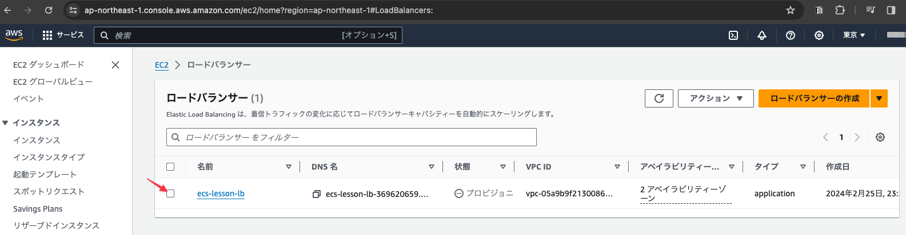

# ロードバランサーの作成

## サービスから`ロードバランサー`を選択する

### 用語の整理

AWSのロードバランシング機能の総称がElastic Load Balancer (ELB)である。ELBには以下の二つのタイプが含まれる。

- Classic Load Balancer (CLB)
- Application Load Balancer (ALB)

名前の通りCLBはクラシックであり初期に存在していたものであり、基本的にはALBを使用する。

## 「ロードバランサーの作成」をクリックする

## 「Application Load Balancer」の「作成」ボタンをクリックする

## 下記の設定に従いロードバランサーを作成する

- ロードバランサー名: ecs-lesson-lb
- ネットワークマッピングのVPCにはCloudFormationで作成したVPC(ecs-lesson-vpc)を選択
- サブネットにはPublic Subnet 1及びPublic Subnet 2を設定
- セキュリティグループにdefault及びsalb_sgを設定

### ターゲットグループの作成リンクをクリックする

リスナーとルーティングにて「ターゲットグループ」を設定する必要があるが、現状はまだ存在しない。本来はECSを構築すると自動で作成される。現在はまだ作成していないので、ここでは適当な値を使用して暫定のターゲットグループを作成する。

### 下記の内容を設定し、画面最下部の「次へ」ボタンをクリックする

※この値は暫定なので特に意味はない

### 「ターゲットグループの作成」ボタンをクリックする

### 作成したターゲットグループを使用して下記の内容を設定し、画面最下部の「ロードバランサーの作成」ボタンをクリックする

リスナーとルーティングにて

- HTTPS(403)に先ほど作成したdeletemeを設定
- HTTP(80)に先ほど作成sたいdeletemeを設定

セキュアリスナーの設定にて

- 証明書の取得先: ACM
- 証明書(ACMから): 以前の作業で作成した証明書

を設定する

## 作成したロードバランサーの一覧を表示し、チェックをONにする

## 「リスナーとルール」タブよりHTTPのルールのリンクをクリックする

## デフォルトルールのチェックをONにし、「アクション」プルダウンより「ルールの編集」をクリックする

## 下記の内容を設定し「変更内容の保存」をクリックする

- デフォルトアクションを「URLにリダイレクト」を選択する
- プロトコルHTTPSのポートを443に設定する

