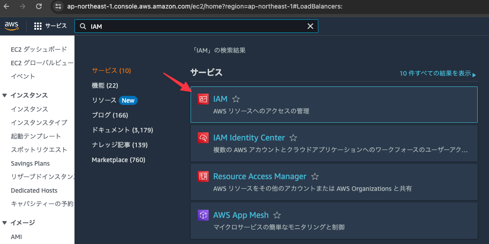
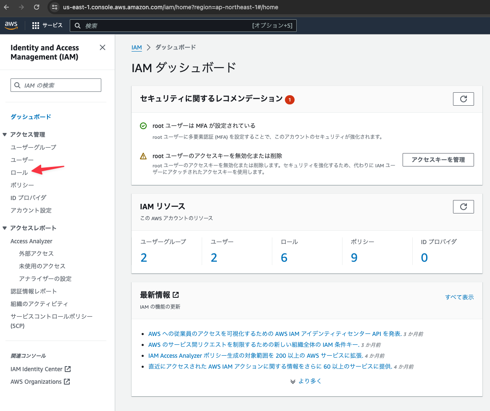
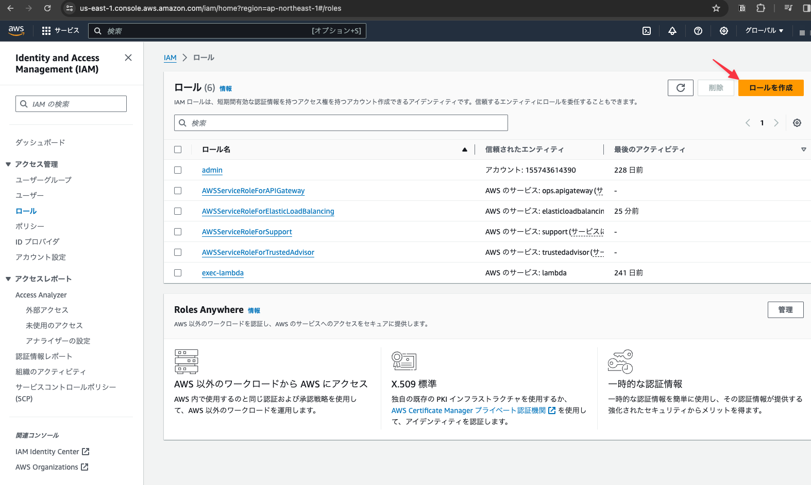
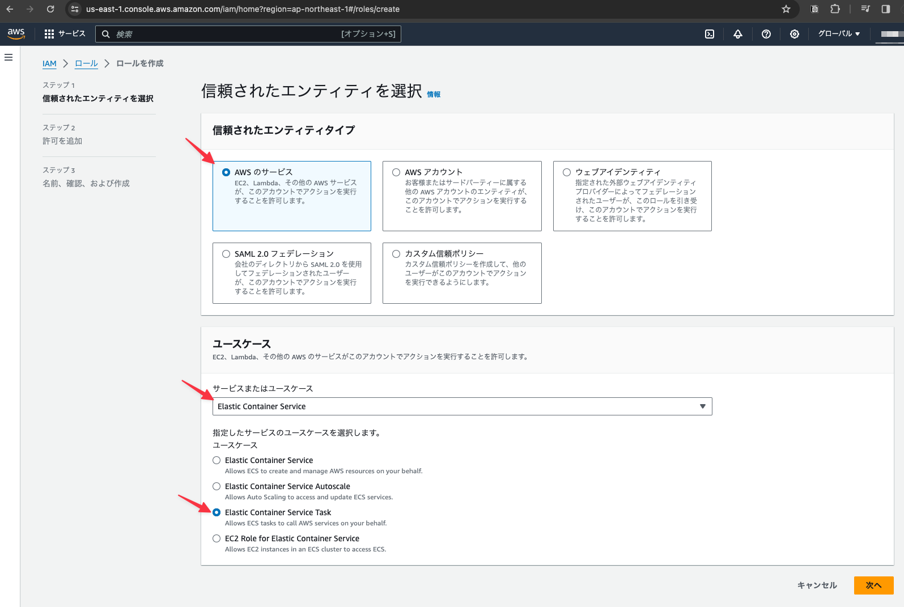
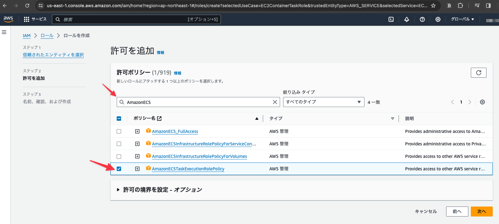
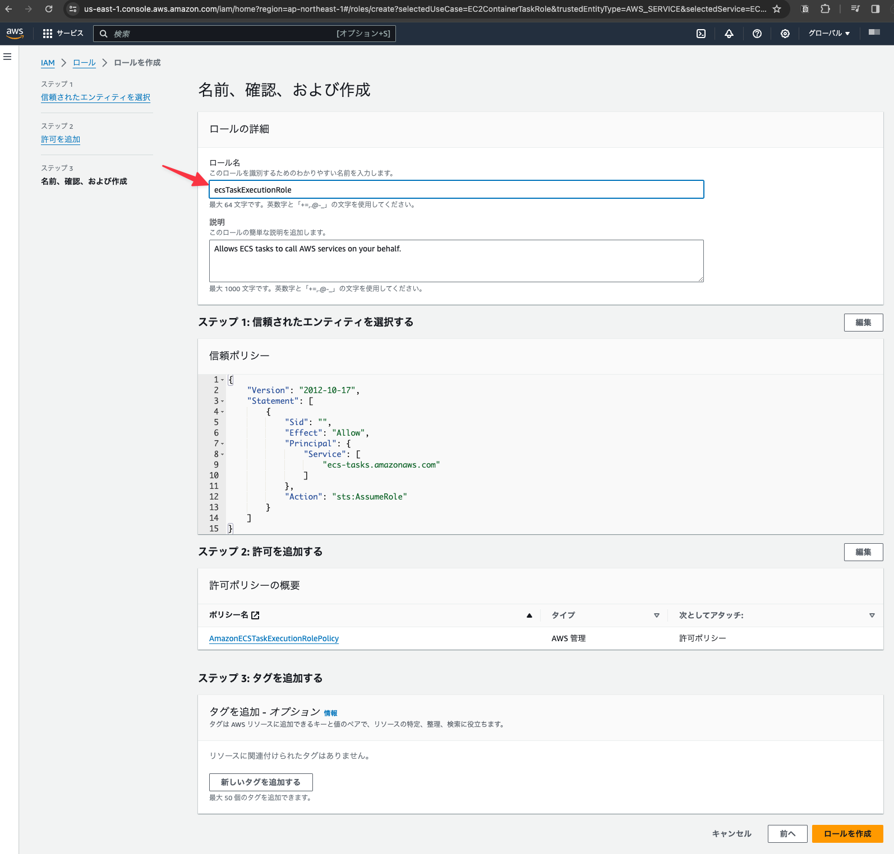

# ECSを操作するためのロールを定義する

## IAMサービスを表示する

## メニューより「ロール」を選択する

## 「ロールの作成」ボタンをクリックする

## 下記の内容を設定し「次へ」ボタンをクリックする

- 信頼されたエンティティタイプ: AWSサービス
- サービス: Elastic Container Service
- ユースケース: Elastic Container Service Task

## 下記の内容を設定し「次へ」ボタンをクリックする

- ポリシー名を入力して候補を絞り込む: Amazon ECS
- AmazonECSTaskExecutionRolePolicyをチェックON

## 下記の内容を設定し「ロールを作成」ボタンをクリックする

- ロール名: ecsTaskExecutionRole

