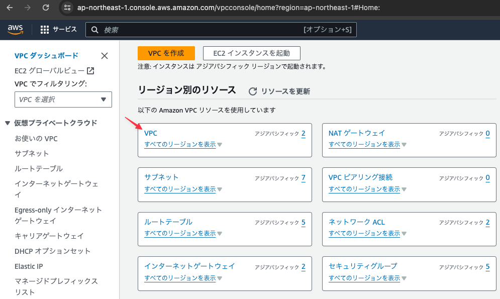
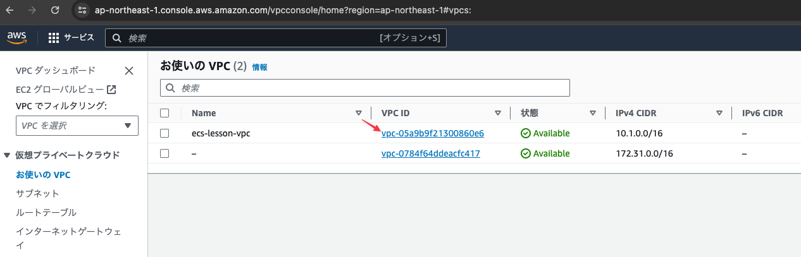
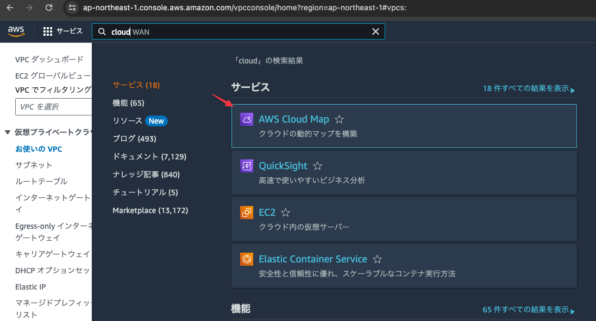
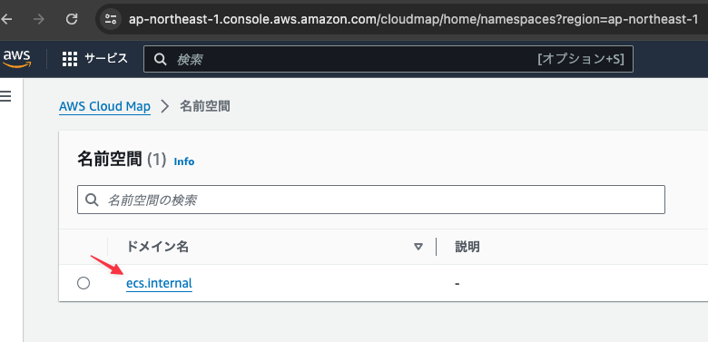

# ECSで使用する名前空間を作成する

## VPCダッシュボードを開きVPCをクリックする



## `ecs-lesson-vpc`のVPC IDを控えておく

このIDを後のコマンドで利用する



## 下記コマンドを実行しECSのサービス検出で利用する名前空間を作成する

```
$ aws servicediscovery create-private-dns-namespace \
    --name ecs.internal \
    --vpc vpc-05a9b9f21300860e6
{
    "OperationId": "vsltuhcr7thhe5irtlm6givry4s3lbwy-6ds5thma"
}
```

# 作成した名前空間を確認する

## サービスからCloud Mapを選択する



## 作成した名前空間が存在することを確認する



# サービス検出機能(servicediscovery)について

サービスと名と名前空間を組み合わせてIPを直接指定せずとも対象サービスのIPを取得できるようになる。

```
ex) sample-webapp.ecs.internal
-> 10.0.0.1
-> 10.0.0.2
```

上記はサービス内に二つのタスクが存在する場合の例。この場合は二つのIPのうちどちらかが返される。