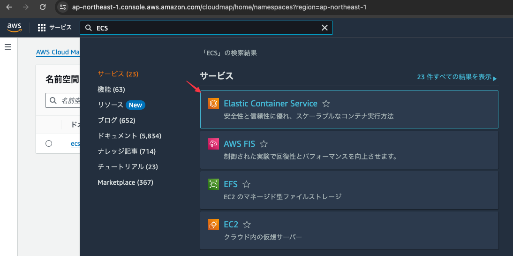
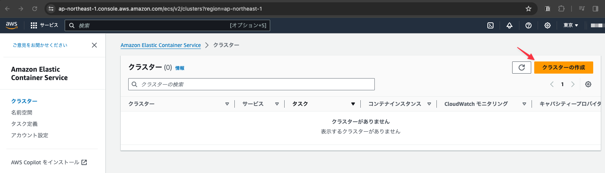
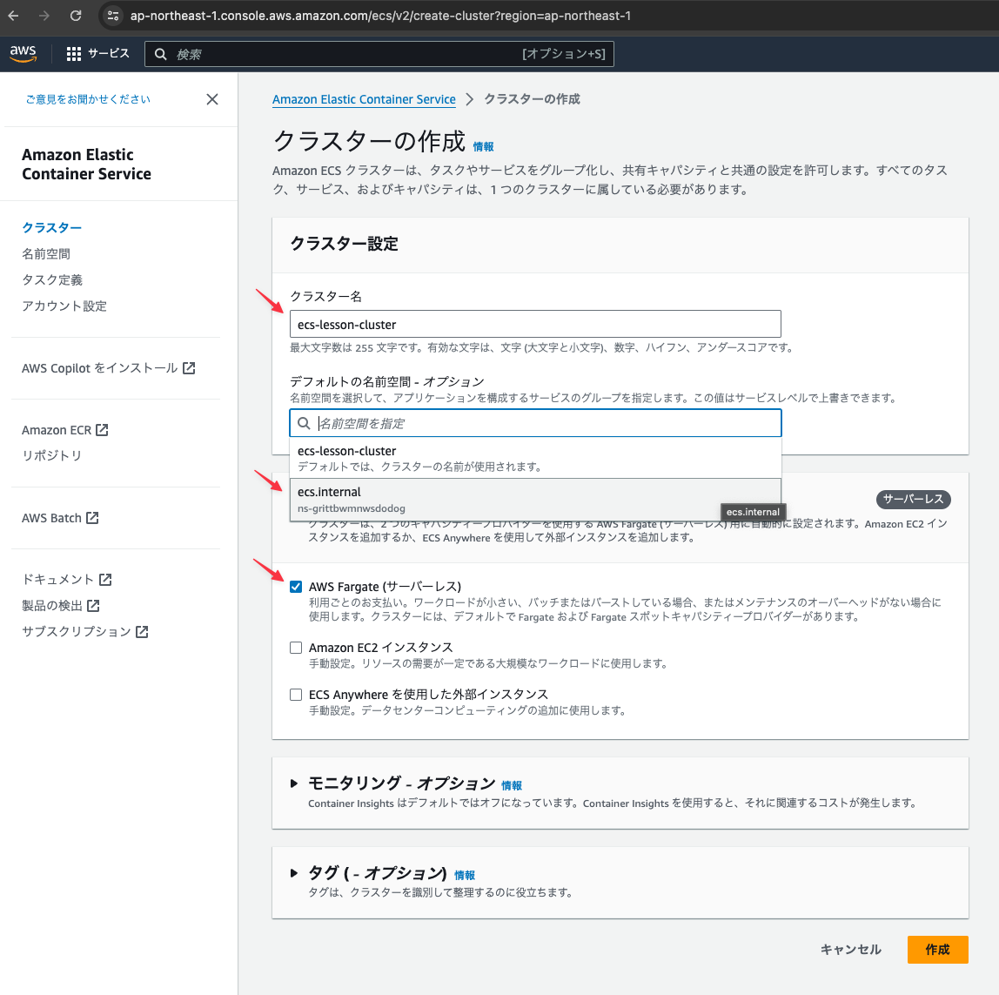

## ECSサービスを開く



## 「クラスターの作成」ボタンをクリックする



## 下記の内容を設定し「作成」ボタンをクリックする

※動画ではVPCを設定する項目があるが、こちらには存在しなかった



# トラブルシューティング

ECSクラスター作成時にエラーになり、もう一度同じ名前で作成しようとしたところ既に存在しているという内容のエラーが発生した。しかし、

```
aws ecs list-clusters
```

コマンドを実行してもクラスターは存在しておらず原因不明となった。ChatGPTに相談した記録を以下に残しておく。


## Q.
```
ecs-lesson-clusterという名前でECSのクラスターをマネージメントコンソールから作成しようとしましたが、エラーになりました。もう一度同じ名前で作成しようとしたところ、下記のエラーがマネージメントコンソールの画面に表示されました。

クラスター ecs-lesson-cluster の作成中にエラーが発生しました。
Stack [Infra-ECS-Cluster-ecs-lesson-cluster-9cedb7bf] already exists

ただし、aws ecs list-clustersコマンドを実行しても、何も表示されません。見えないクラスターの残骸が残っているように見えるのですが、どうしたらいいですか
```

## A.

```
エラーメッセージ Stack [Infra-ECS-Cluster-ecs-lesson-cluster-9cedb7bf] already exists は、AWS CloudFormationスタックが既に存在することを示しています。ECSクラスターの作成時に裏側でCloudFormationスタックが使用される場合があります。このエラーは、前回の作成プロセスが完全には成功せず、クリーンアップされなかったCloudFormationスタックが残っている場合に発生することがあります。

対処方法としては、次のステップを試みてください：

1. AWS Management Consoleにアクセスして、CloudFormationコンソールを開きます。
2. エラーメッセージに表示されているスタック名（この場合は Infra-ECS-Cluster-ecs-lesson-cluster-9cedb7bf）を探します。
3. スタックを選択し、Deleteまたはスタックの削除オプションを使用して、スタックを削除します。
4. スタックの削除が完了した後、再度ECSクラスターの作成を試みます。
これにより、以前の操作で残ってしまったリソースがクリーンアップされ、再度クラスターを作成する際の問題が解決されるはずです。
```

なお、AWS CLIを使用してCloudFormationスタックを削除することも可能

```
aws cloudformation delete-stack --stack-name Infra-ECS-Cluster-ecs-lesson-cluster-9cedb7bf
```