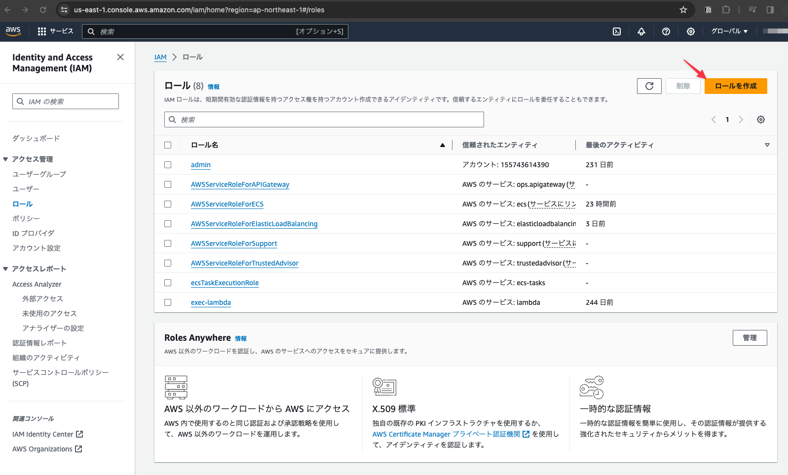
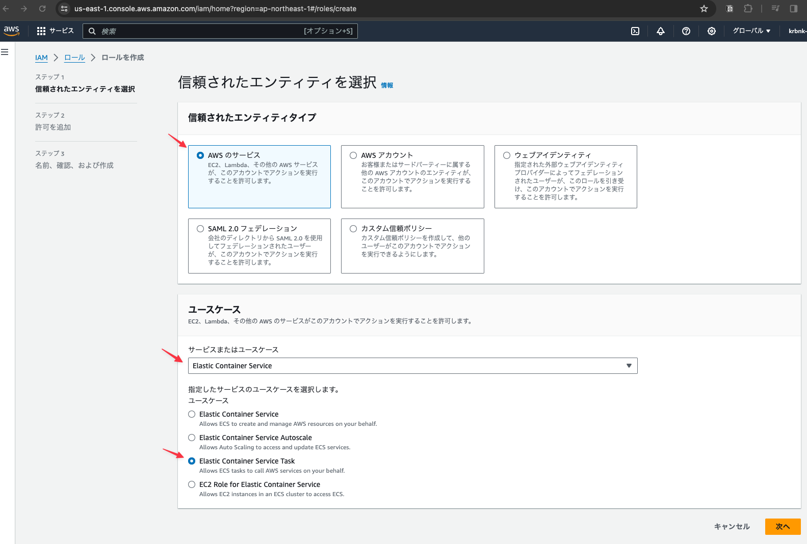
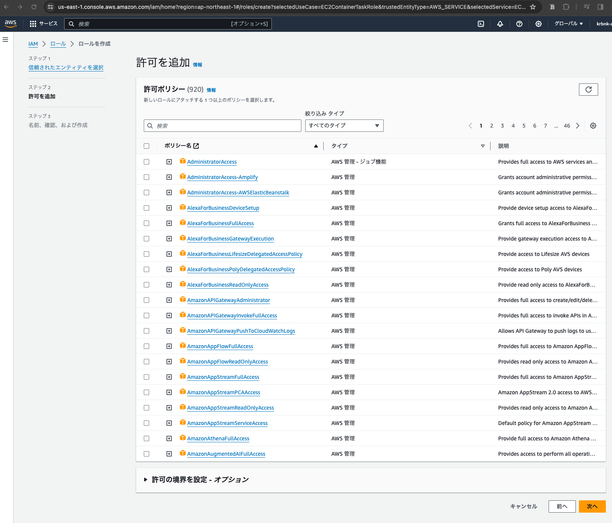
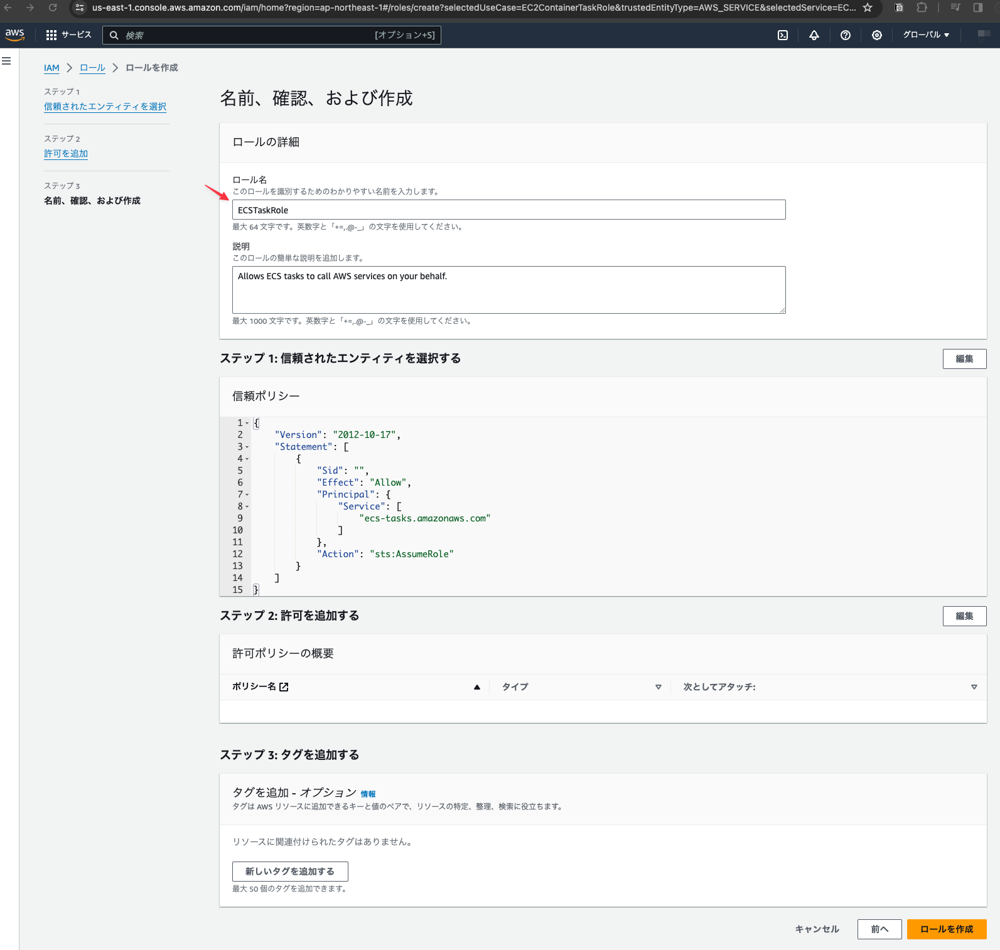

# ECSタスク用のロールを作成する

タスク(アプリケーション)が必要となる権限を付与するためのロールを作成する。

ex) S3にアクセスするetc

## IAMサービスのメニューから「ロール」をクリックする

## 「ロールを作成」ボタンをクリックする

## 下記の内容を設定し「次へ」ボタンをクリックする

## 必要な許可を設定する

今回は特に必要な許可はないため、何も設定せずに「次へ」をクリックする

## ロール名を設定し「ロールを作成」ボタンをクリックする

