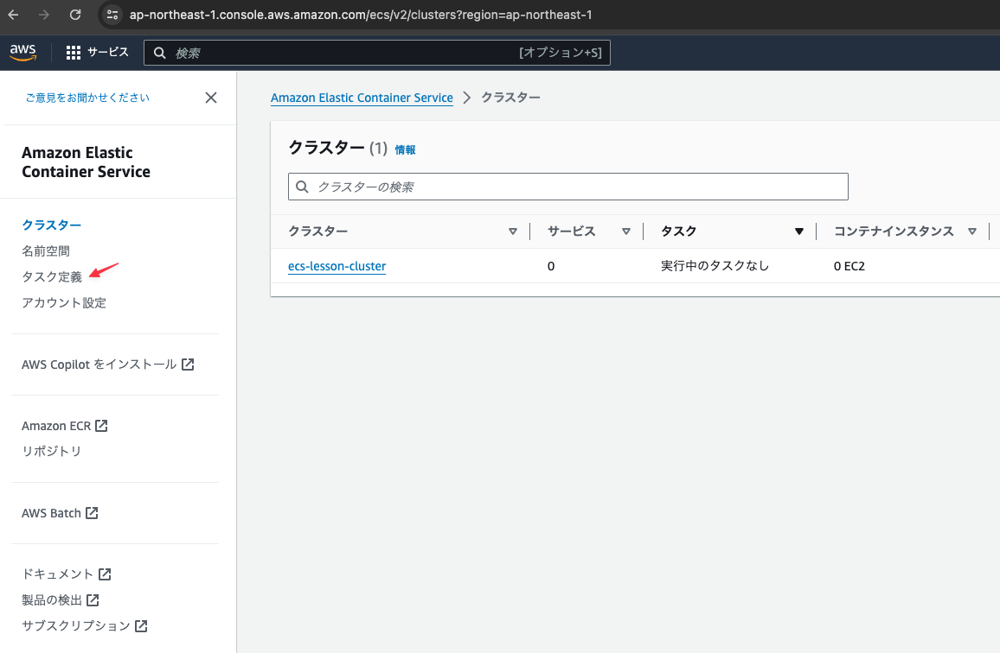
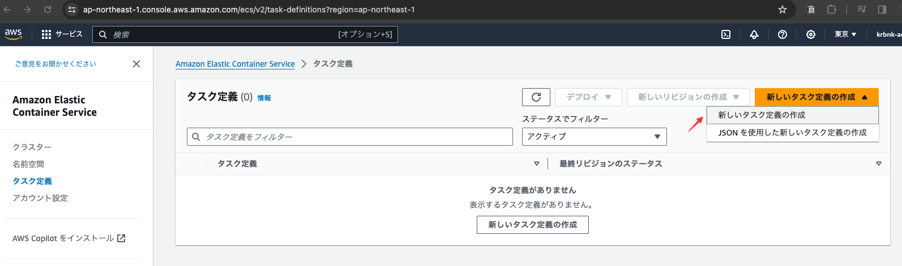
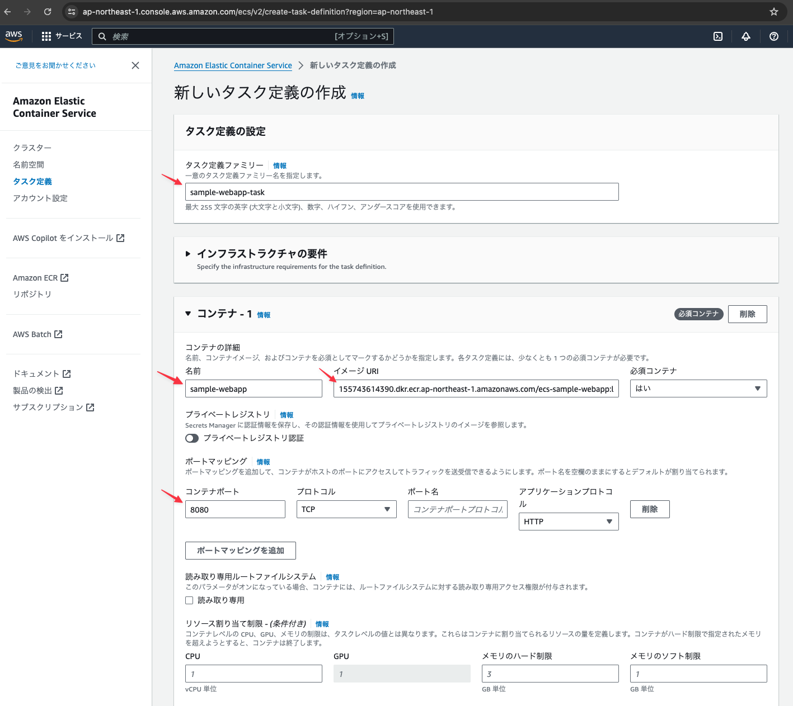
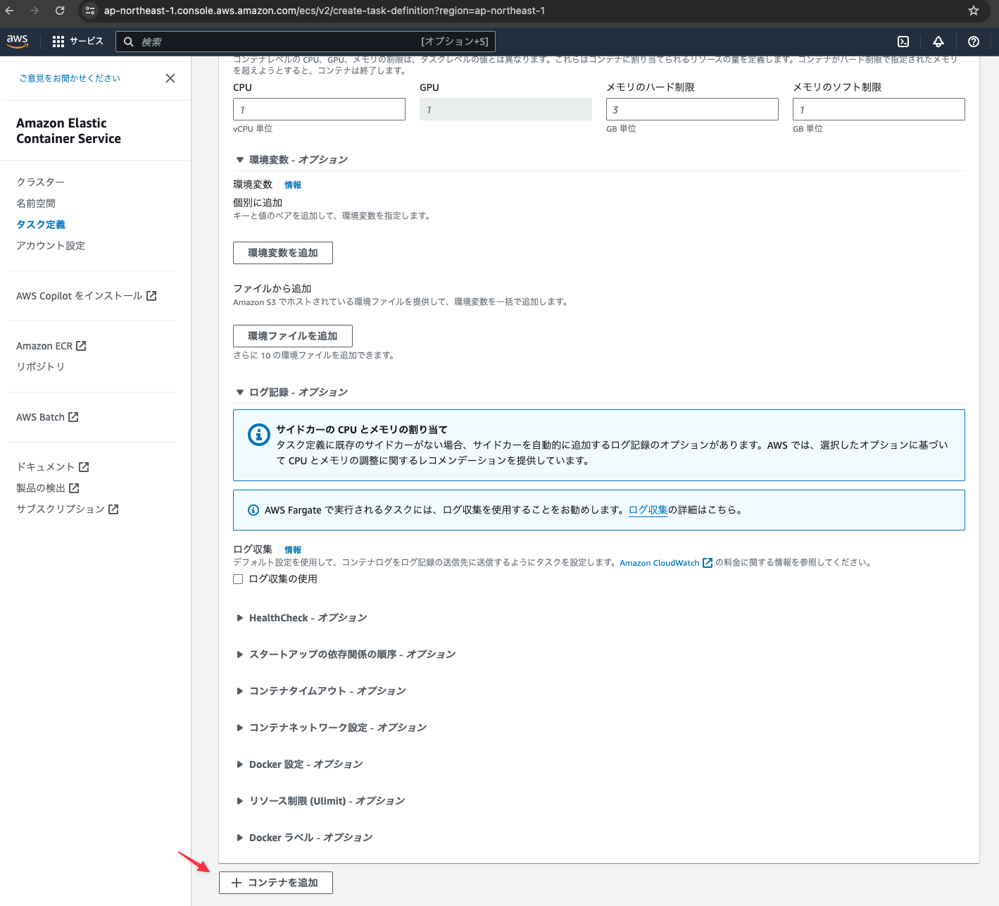
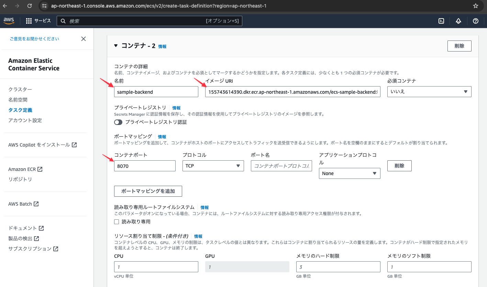
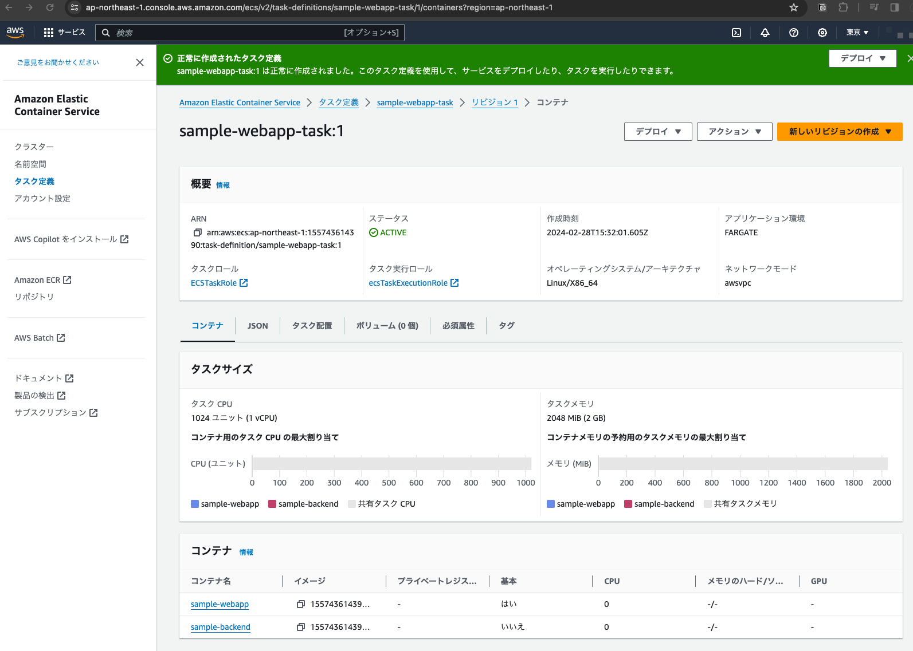

# ECSのタスク定義の作成

## ECSサービスの左メニューより「「タスク定義」をクリックする

## 「新しいタスク定義の作成」をクリックする

## 下記の内容を設定する

- タスク名:sample-webapp-task
- コンテナ-1の名前: sample-webapp
- コンテナ-1のイメージURI: ECRに作成したwebappのイメージのURL
- コンテナ-1のポート: 8080

## コンテナ設定入力エリアの下にある「+コンテナを追加」ボタンをクリックする

## 下記の内容を設定する

- コンテナ-1の名前: sample-backend
- コンテナ-1のイメージURI: ECRに作成したbackendのイメージのURL
- コンテナ-1のポート: 8070

## 作成されたタスク定義を確認する

