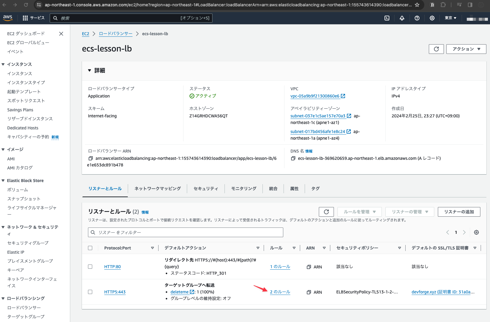
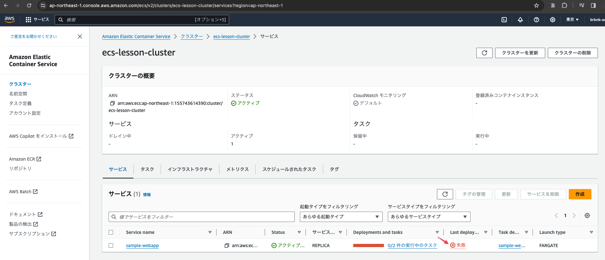

# ECSサービスの作成

## ECSクラスターの一覧より`ecs-lesson-cluster`をクリックする


## サービスの「作成」ボタンをクリックする


## 下記の内容を設定する


## 続いて下記の内容を設定する


## 続いて下記の内容を設定し「作成」ボタンをクリックする


## ロードバランサーのターゲットグループを入れ替え
以前ロードバランサーの設定をしたときに暫定のターゲットグループを設定(deleteme)したので、ECSサービス時に同時に作成した新しいターゲットグループに入れ替える。

### EC2サービスの左メニューより「ロードバランサー」をクリックする


### ロードバランサーの一覧より`ecs-lesson-lb`をクリックする


### HTTPSのルールの`2のルール`リンクをクリックする



### ルールを更新する

- 1行目のルールは削除する
- 2行目のルールは更新して`deleteme`を`ecs-sample-webapp`に入れ替える


### 下記の内容を設定し変更を保存する


### ルールが正しく更新されたことを確認する


## ロードバランサーのDNS名を後で使用するためにメモしておく


## トラブル発生: サービスのデプロイに失敗。リカバリーに着手



## <font color="red">トラブルシューティング</font>

以降の作業(15:ECSサービスのデプロイ)でイメージが正しく作られていないことが原因と思われるエラーが発生した。この問題を解決するために以下の作業を行った。

### 原因

イメージの生成に使用したPCがM1 Macであるため、デフォルトでArm64向けのイメージが作成されたため、ECSコンテナはX86_64イメージを前提としているためコンテナを正しく起動できないことが原因と思われる。

### イメージのプラットフォームを確認する

確かにarm64向けにビルドされていることを確認した

```
$ docker inspect ecs-sample-webapp | grep Archi
        "Architecture": "arm64",
```

### イメージを再作成〜ECRへの再PUSH

- ecs-sample-webapp

```
$ cd sample-webapp
$ docker build --platform linux/amd64 -t ecs-sample-webapp .

# tag latest
$ docker tag ecs-sample-webapp:latest 155743614390.dkr.ecr.ap-northeast-1.amazonaws.com/ecs-sample-webapp:latest

# tag 1.0.1
$ docker tag 155743614390.dkr.ecr.ap-northeast-1.amazonaws.com/ecs-sample-webapp:latest 155743614390.dkr.ecr.ap-northeast-1.amazonaws.com/ecs-sample-webapp:1.0.1

# push latest
$ docker push 155743614390.dkr.ecr.ap-northeast-1.amazonaws.com/ecs-sample-webapp:latest

# push 1.0.1
$ docker push 155743614390.dkr.ecr.ap-northeast-1.amazonaws.com/ecs-sample-webapp:1.0.1
```

- ecs-sample-backend

```
$ cd sample-backend
$ docker build --platform linux/amd64 -t ecs-sample-backend .

# tag latest
$ docker tag ecs-sample-backend:latest 155743614390.dkr.ecr.ap-northeast-1.amazonaws.com/ecs-sample-backend:latest

# tag 1.0.1
$ docker tag 155743614390.dkr.ecr.ap-northeast-1.amazonaws.com/ecs-sample-backend:latest 155743614390.dkr.ecr.ap-northeast-1.amazonaws.com/ecs-sample-backend:1.0.1

# push latest
$ docker push 155743614390.dkr.ecr.ap-northeast-1.amazonaws.com/ecs-sample-backend:latest

# push 1.0.1
$ docker push 155743614390.dkr.ecr.ap-northeast-1.amazonaws.com/ecs-sample-backend:1.0.1
```

- ecs-sample-restapi

```
$ cd sample-restapi
$ docker build --platform linux/amd64 -t ecs-sample-restapi .

# tag latest
$ docker tag ecs-sample-restapi:latest 155743614390.dkr.ecr.ap-northeast-1.amazonaws.com/ecs-sample-restapi:latest

# tag 1.0.1
$ docker tag 155743614390.dkr.ecr.ap-northeast-1.amazonaws.com/ecs-sample-restapi:latest 155743614390.dkr.ecr.ap-northeast-1.amazonaws.com/ecs-sample-restapi:1.0.1

# push latest
$ docker push 155743614390.dkr.ecr.ap-northeast-1.amazonaws.com/ecs-sample-restapi:latest

# push 1.0.1
$ docker push 155743614390.dkr.ecr.ap-northeast-1.amazonaws.com/ecs-sample-restapi:1.0.1
```

<font color="red">※バージョンを1.0.1に上げている点に注意</font>

### ECSサービス画面の左メニューより「タスク定義」をクリックする


### `sample-webapp-task`を選択し「新しいリビジョンの作成」ボタンをクリックする


### イメージのバージョンを1.0.1へ変更する

- 元々はlatestとなっていたが、常に明示的なバージョン番号を指定する方が好ましい
- スクショを省略しているがコンテナ2のバージョンも1.0.1へ変更している


### タスクのリビジョン2が作成された事を確認


### `ecs-lesson-cluster`画面を表示し`sample-webapp`サービスをクリックする


### 「サービスを更新」ボタンをクリックする


### タスクのリビジョンを2に変更して保存する


### デプロイが正常に終了したことを確認した


### ブラウザで動作確認

以前コピーしたロードバランサーのDNS名をブラウザのURL欄に入力する


## <font color="red">ECSの料金に関する注意</font>

ECSのタスクは起動時間に応じて課金されるため

- サービスを更新してタスクの数を0にする
- サービスそのものを削除する

などの対応をした方が良い。