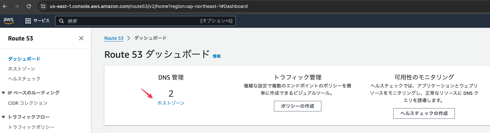
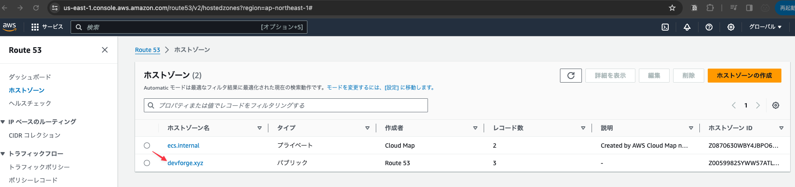
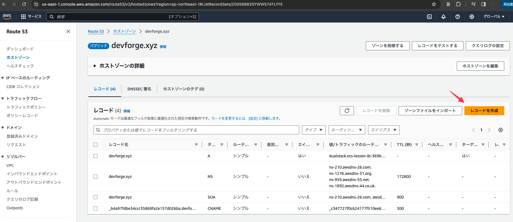
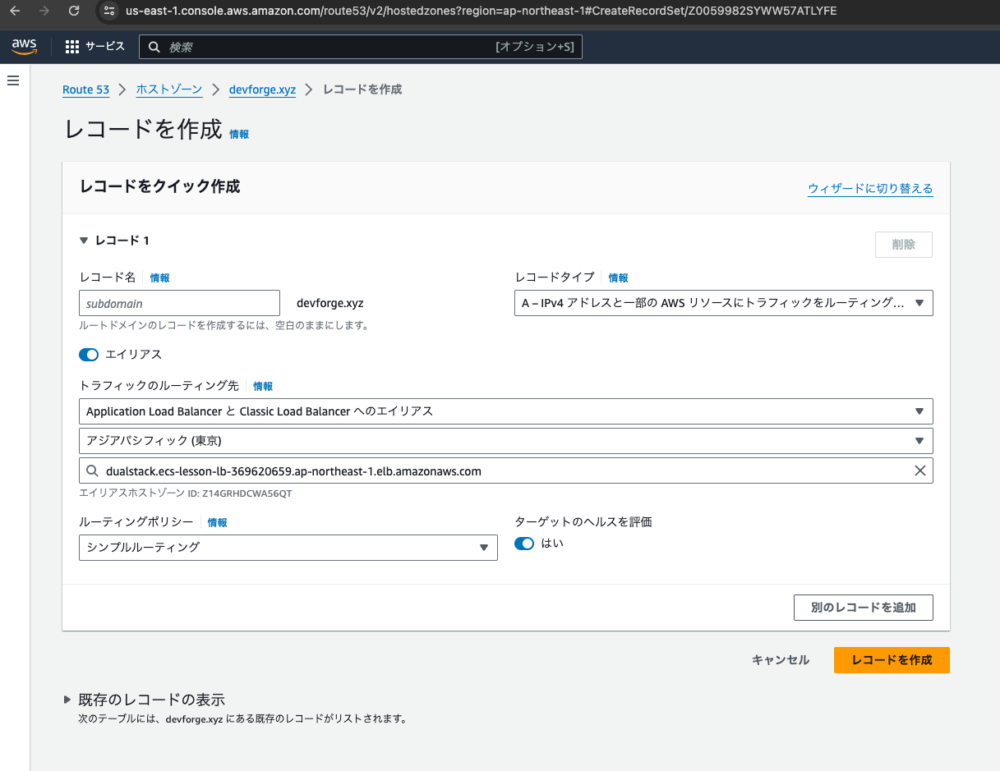
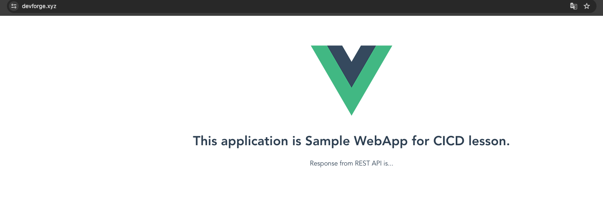

# Route53でレコードを追加する

取得した独自ドメインを使ってアクセスできるように設定をする

## Route53のサービスを開き「ホストゾーン」をクリックする

## 取得したドメイン名のホストゾーンをクリックする

## 「レコードの作成」ボタンをクリックする

## 下記の内容を設定し「レコードを作成」ボタンをクリックする

- レコードタイプ: A
- エイリアスをONにする
- トラフィックのルーティング先: ALB
- リージョン: 使用しているリージョン(Asiaパシフィック)
- ロードバランサー: 動画内で作成したロードバランサーを設定(そもそも選択肢は一つしかなかったが)

## あらためてドメイン名でアクセスできる事を確認する

