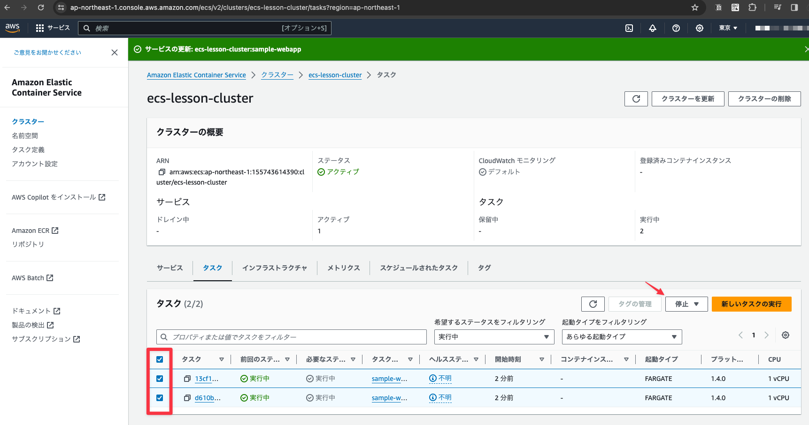
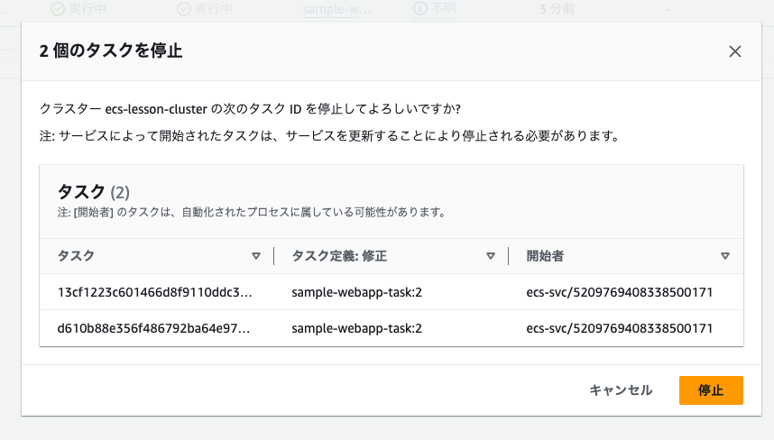
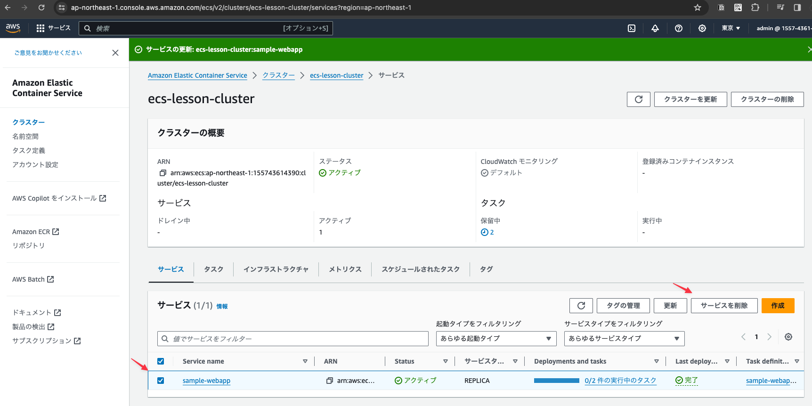
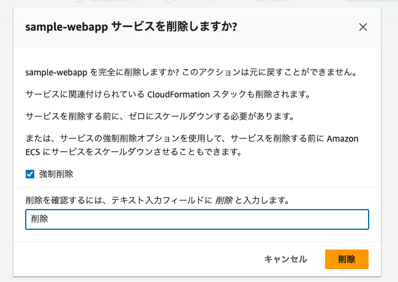
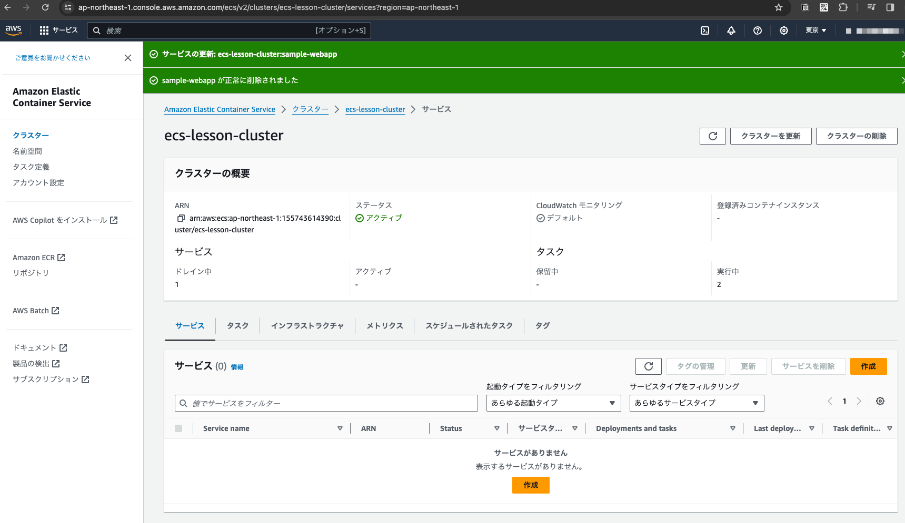

# webappサービスの削除

以降のステップでロードバランサーからbackendへリクエストを流すようにサービスを再作成するために、いったん既存のサービスを削除する

## 「タスク」タブをクリックし全てのチェックをONにして「停止」ボタンをクリックする

サービスを削除するためにはタスクを事前に停止する必要があるためタスクを停止する

## 確認ダイアログの「停止」ボタンをクリックする

## 「サービス」タブをクリックしてチェックをONにして「サービスを削除」ボタンをクリックする

## 確認ダイアログの「削除」ボタンをクリックする

## サービスが削除されたことを確認する

