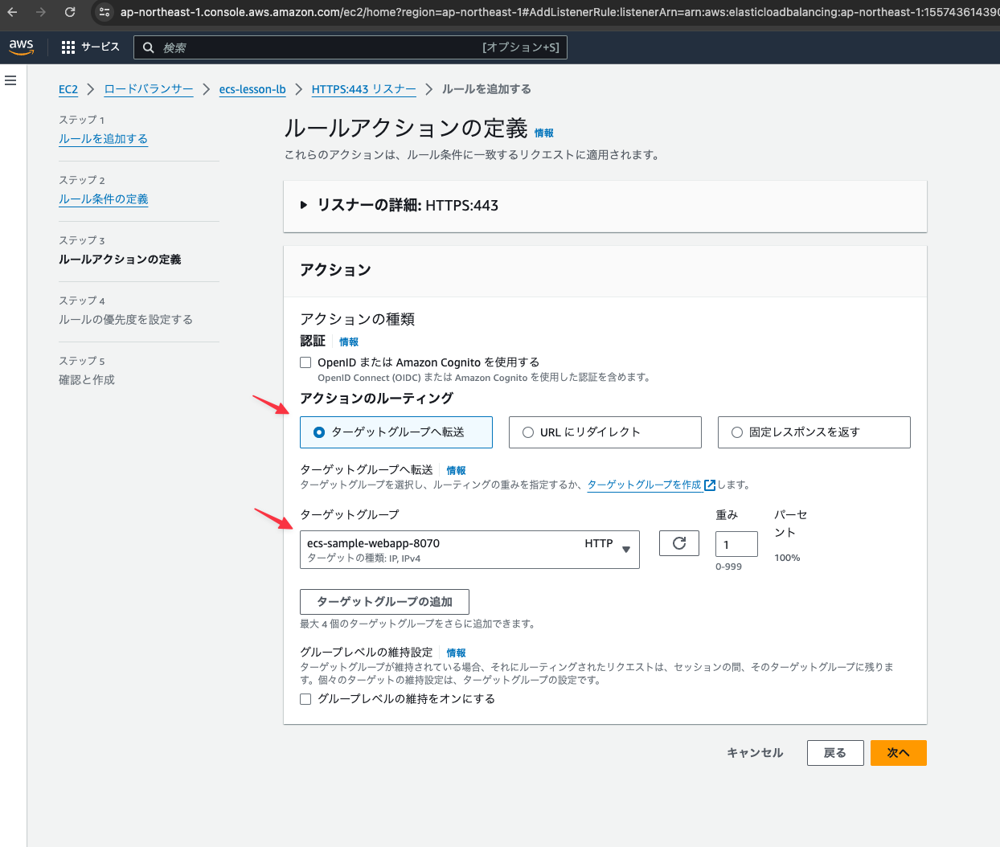

## EC2サービスの左メニューから「ターゲットグループ」をクリックする

## 「ターゲットグループの作成」ボタンをクリック

## 下記の内容を設定し画面下部の「作成」ボタンをクリックする

## 「削除ボタン」をクリックしてから「ターゲットグループの作成」をクリックする

## ターゲットグループが作成されたことを確認する

## 左メニューの「ロードバランサー」をクリックし「リスナーとルール」タブ内の「1のルール」リンクをクリックする

## 「ルールを追加する」ボタンをクリックする

## 任意の名前を入力し「次へ」ボタンをクリックする

ここでは`backend`と入力することにする

## 「条件の追加」ボタンをクリックする

## 下記の内容を設定し「確認」ボタンをクリックする

- ルールの条件タイプ: パス
- パス: `/api`

## そのまま「次へ」ボタンをクリックする

## 下記の内容を設定し「次へ」ボタンをクリックする

- アクションのルーティング: ターゲットグループへ転送
- ターゲットグループ: ecs-sample-webapp-8070 ※先ほど新しく作成したターゲットグループ

## 任意の優先度を設定し「次へ」ボタンをクリックする

## 「作成」ボタンをクリックする

## 新しいリスナールールが追加されていることを確認する

