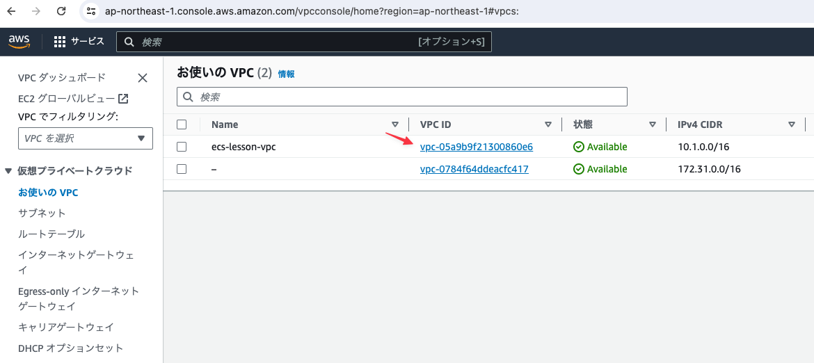
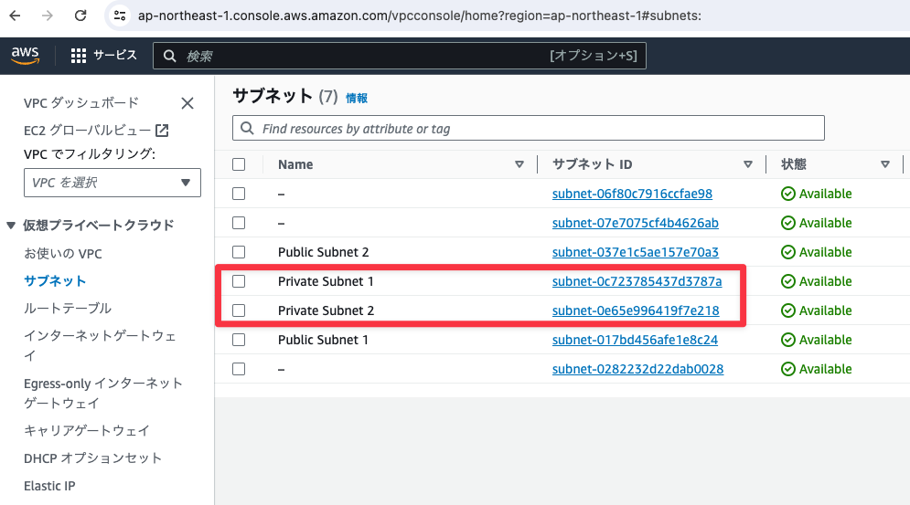
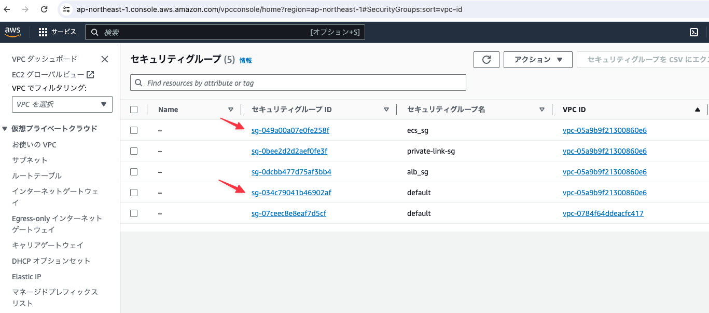
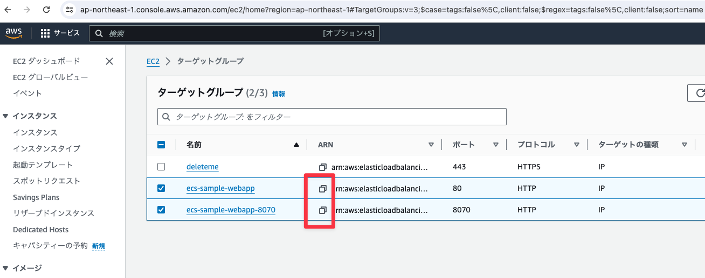
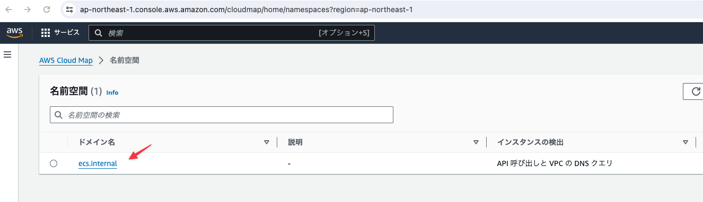
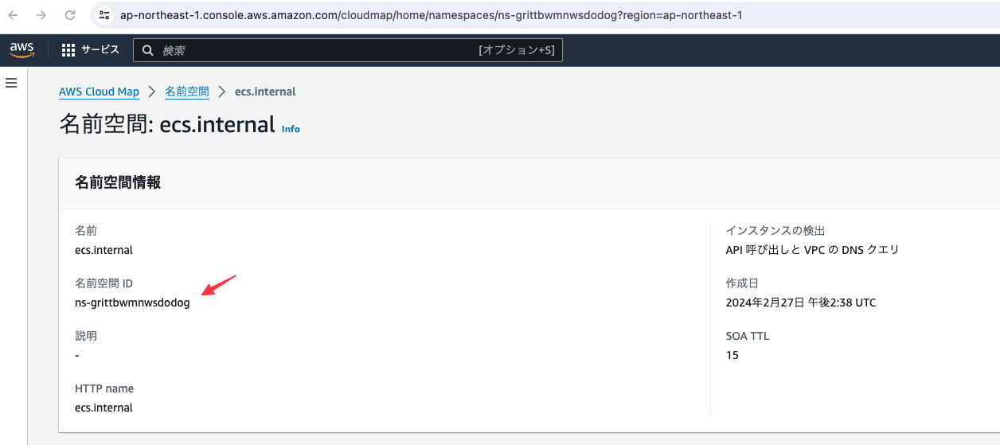
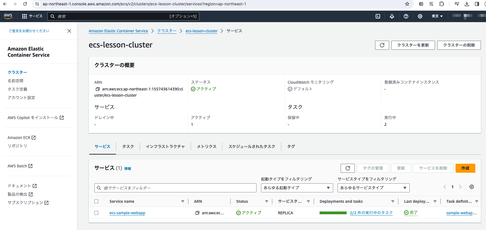

# ECSサービスの再作成

先ほど削除したサービスを再度作成するためにAWS CLIを使って作業を行う。作業のために各種IDが必要になるので以降でIDをメモしていく。

## VPCサービスの「お使いのVPC」メニューよりVPC IDをメモする

- VPC ID: `vpc-05a9b9f21300860e6`



## VPCサービスの「サブネット」メニューよりPrivate Subnet(2つ)のIDをメモする

- Private Subnet1: `subnet-0c723785437d3787a`
- Private Subnet1: `subnet-0e65e996419f7e218`



## VPCサービスの「セキュリティグループ」メニューより下記のセキュリティグループIDをメモする

- default: `sg-034c79041b46902af`
- ecs-sg: `sg-049a00a07e0fe258f`



## EC2サービスの「ターゲットグループ」メニューより二つのターゲットグループのIDをメモする

- webaapp: `arn:aws:elasticloadbalancing:ap-northeast-1:155743614390:targetgroup/ecs-sample-webapp/be573b2ef494e020`
- webapp-8070: `arn:aws:elasticloadbalancing:ap-northeast-1:155743614390:targetgroup/ecs-sample-webapp-8070/388979a85b959424`



## Cloudmapのサービスから`ecs.internal`をクリックする



## 名前空間IDをメモする

- 名前空間ID: `ns-grittbwmnwsdodog`



## AWS CLIで名前空間を登録する

下記のコマンドを実行する

```
aws servicediscovery create-service \
  --name sample-webapp \
  --dns-config 'NamespaceId="[取得したネームスペースID]",DnsRecords=[{Type="A",TTL="60"}]' \
  --health-check-custom-config FailureThreshold=1 \
  --region ap-northeast-1
```

### 実行結果

  ```
$ aws servicediscovery create-service \
  --name sample-webapp \
  --dns-config 'NamespaceId="ns-grittbwmnwsdodog",DnsRecords=[{Type="A",TTL="60"}]' \
  --health-check-custom-config FailureThreshold=1 \
  --region ap-northeast-1
{
    "Service": {
        "Id": "srv-tyh3au22xod57yvo",
        "Arn": "arn:aws:servicediscovery:ap-northeast-1:155743614390:service/srv-tyh3au22xod57yvo",
        "Name": "sample-webapp",
        "NamespaceId": "ns-grittbwmnwsdodog",
        "DnsConfig": {
            "NamespaceId": "ns-grittbwmnwsdodog",
            "RoutingPolicy": "MULTIVALUE",
            "DnsRecords": [
                {
                    "Type": "A",
                    "TTL": 60
                }
            ]
        },
        "Type": "DNS_HTTP",
        "HealthCheckCustomConfig": {
            "FailureThreshold": 1
        },
        "CreateDate": "2024-03-09T12:25:26.563000+09:00",
        "CreatorRequestId": "d60c0c1c-941a-4c44-afa9-37bf41e5a7c1"
    }
}
```

## AWS CLIでサービスを作成する

下記のコマンドを実行する

```
aws ecs create-service \
  --cluster ecs-lesson-cluster \
  --service-name sample-webapp \
  --task-definition sample-webapp-task \
  --load-balancers '[{"targetGroupArn": "[frontend用のTargetGroupArn]", "containerName": "sample-webapp",  "containerPort": 8080 },{ "targetGroupArn": "[backend用のTargetGroupArn]", "containerName": "sample-backend", "containerPort":8070 }]' \
  --desired-count 2 \
  --platform-version LATEST \
  --launch-type FARGATE \
  --network-configuration '{"awsvpcConfiguration": {"subnets":["[取得したSubnetID1]","[取得したSubnetID2]"],"securityGroups": ["[取得したセキュリティグループID1]","[取得したセキュリティグループID2]"],"assignPublicIp":"DISABLED"}}' \
  --service-registries '[{"registryArn":"[レジストリーARN]"}]'
```

上記の`[レジストリーARN]`には一つ目のコマンドの実行結果に含まれるARNを指定する

### 実行結果

```
aws ecs create-service \
  --cluster ecs-lesson-cluster \
  --service-name sample-webapp \
  --task-definition sample-webapp-task \
  --load-balancers '[{"targetGroupArn": "arn:aws:elasticloadbalancing:ap-northeast-1:155743614390:targetgroup/ecs-sample-webapp/be573b2ef494e020", "containerName": "sample-webapp",  "containerPort": 8080 },{ "targetGroupArn": "arn:aws:elasticloadbalancing:ap-northeast-1:155743614390:targetgroup/ecs-sample-webapp-8070/388979a85b959424", "containerName": "sample-backend", "containerPort":8070 }]' \
  --desired-count 2 \
  --platform-version LATEST \
  --launch-type FARGATE \
  --network-configuration '{"awsvpcConfiguration": {"subnets":["subnet-0c723785437d3787a","subnet-0e65e996419f7e218"],"securityGroups": ["sg-034c79041b46902af","sg-049a00a07e0fe258f"],"assignPublicIp":"DISABLED"}}' \
  --service-registries '[{"registryArn":"arn:aws:servicediscovery:ap-northeast-1:155743614390:service/srv-tyh3au22xod57yvo"}]'
  ```

※レスポンスが長すぎて操作ミスにより取得漏れ

## AWS CLLでサービスが作成されていることを確認する

```
$ aws ecs list-services --cluster ecs-lesson-cluster
{
    "serviceArns": [
        "arn:aws:ecs:ap-northeast-1:155743614390:service/ecs-lesson-cluster/ecs-sample-webapp"
    ]
}
```

## マネージメントコンソールからも確認する




---

### MEMO

マネージメントコンソールの新しいUIではサービスディスカバリーを作成できないためCLIを使わざるを得ないという事情がある模様。