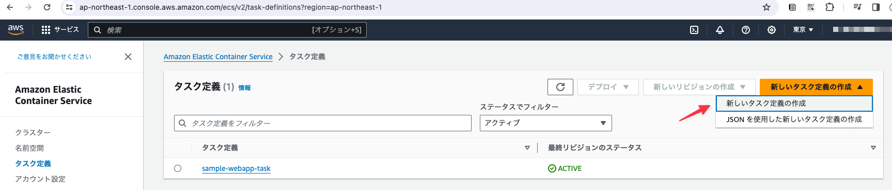
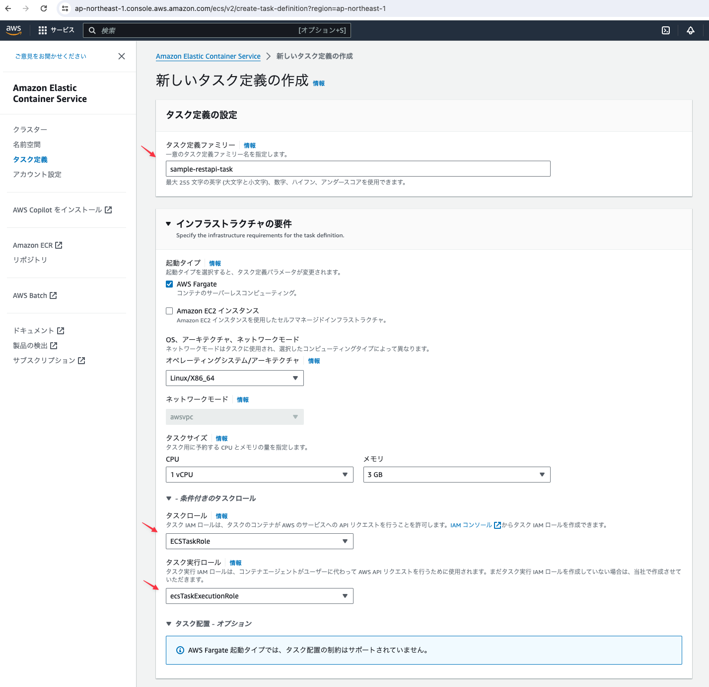
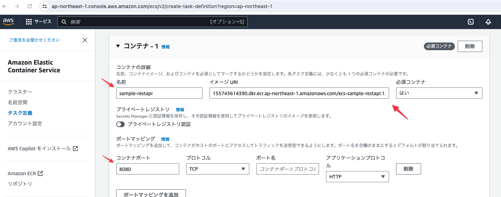
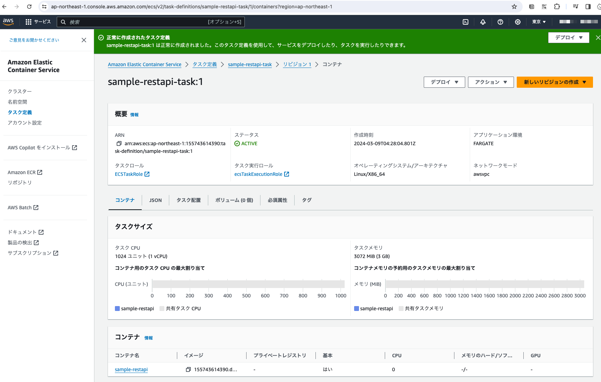

# RestAPI用のタスク定義を作成する

## ECSサービスの「タスク定義」メニューより「新しいタスク定義の作成」ボタンをクリックする

## 下記の内容で項目を設定する

## さらに下記の内容でコンテナ用の項目を設定し「作成」ボタンをクリックする

イメージURIにはすでに作成したRestAPI用のECRイメージのURIを設定する。

イメージURI: `155743614390.dkr.ecr.ap-northeast-1.amazonaws.com/ecs-sample-restapi:1.0.1`

## タスク定義が作成されたことを確認する

