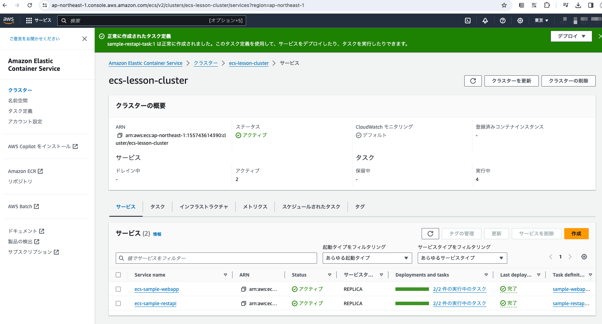
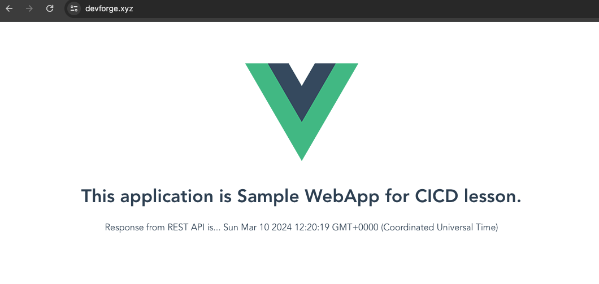

# REST API用のサービスを作成する

以前と同様にCLIを使ってサービスを作成する

## サービスディスカバリーの作成

```
$ aws servicediscovery create-service \
  --name sample-restapi \
  --dns-config 'NamespaceId="ns-grittbwmnwsdodog",DnsRecords=[{Type="A",TTL="60"}]' \
  --health-check-custom-config FailureThreshold=1
{
    "Service": {
        "Id": "srv-gzjenhkgueelljkm",
        "Arn": "arn:aws:servicediscovery:ap-northeast-1:155743614390:service/srv-gzjenhkgueelljkm",
        "Name": "sample-restapi",
        "NamespaceId": "ns-grittbwmnwsdodog",
        "DnsConfig": {
            "NamespaceId": "ns-grittbwmnwsdodog",
            "RoutingPolicy": "MULTIVALUE",
            "DnsRecords": [
                {
                    "Type": "A",
                    "TTL": 60
                }
            ]
        },
        "Type": "DNS_HTTP",
        "HealthCheckCustomConfig": {
            "FailureThreshold": 1
        },
        "CreateDate": "2024-03-10T17:20:25.966000+09:00",
        "CreatorRequestId": "689acd75-db1c-42a5-9d0f-7487779b843a"
    }
}
```

## RestAPIサービス作成

```
$ aws ecs create-service \
  --cluster ecs-lesson-cluster \
  --service-name sample-restapi \
  --task-definition sample-restapi-task \
  --desired-count 2 \
  --platform-version LATEST \
  --launch-type FARGATE \
  --network-configuration '{"awsvpcConfiguration": {"subnets":["subnet-0c723785437d3787a","subnet-0e65e996419f7e218"],"securityGroups": ["sg-034c79041b46902af","sg-049a00a07e0fe258f"],"assignPublicIp":"DISABLED"}}' \
  --service-registries '[{"registryArn":"arn:aws:servicediscovery:ap-northeast-1:155743614390:service/srv-gzjenhkgueelljkm"}]'
{
    "service": {
        "serviceArn": "arn:aws:ecs:ap-northeast-1:155743614390:service/ecs-lesson-cluster/ecs-sample-restapi",
        "serviceName": "ecs-sample-restapi",
        "clusterArn": "arn:aws:ecs:ap-northeast-1:155743614390:cluster/ecs-lesson-cluster",
        "loadBalancers": [],
        "serviceRegistries": [
            {
                "registryArn": "arn:aws:servicediscovery:ap-northeast-1:155743614390:service/srv-za4afr65s2qrk3df"
            }
        ],
        "status": "ACTIVE",
        "desiredCount": 2,
        "runningCount": 0,
        "pendingCount": 0,
        "launchType": "FARGATE",
        "platformVersion": "LATEST",
        "platformFamily": "Linux",
        "taskDefinition": "arn:aws:ecs:ap-northeast-1:155743614390:task-definition/sample-restapi-task:1",
        "deploymentConfiguration": {
            "deploymentCircuitBreaker": {
                "enable": false,
                "rollback": false
            },
            "maximumPercent": 200,
            "minimumHealthyPercent": 100
        },
        "deployments": [
            {
                "id": "ecs-svc/9035911804397253226",
                "status": "PRIMARY",
                "taskDefinition": "arn:aws:ecs:ap-northeast-1:155743614390:task-definition/sample-restapi-task:1",
                "desiredCount": 2,
                "pendingCount": 0,
                "runningCount": 0,
                "failedTasks": 0,
                "createdAt": "2024-03-09T13:49:53.251000+09:00",
                "updatedAt": "2024-03-09T13:49:53.251000+09:00",
                "launchType": "FARGATE",
                "platformVersion": "1.4.0",
                "platformFamily": "Linux",
                "networkConfiguration": {
                    "awsvpcConfiguration": {
                        "subnets": [
                            "subnet-0c723785437d3787a",
                            "subnet-0e65e996419f7e218"
                        ],
                        "securityGroups": [
                            "sg-034c79041b46902af",
                            "sg-049a00a07e0fe258f"
                        ],
                        "assignPublicIp": "DISABLED"
                    }
                },
                "rolloutState": "IN_PROGRESS",
                "rolloutStateReason": "ECS deployment ecs-svc/9035911804397253226 in progress."
            }
        ],
        "roleArn": "arn:aws:iam::155743614390:role/aws-service-role/ecs.amazonaws.com/AWSServiceRoleForECS",
        "events": [],
        "createdAt": "2024-03-09T13:49:53.251000+09:00",
        "placementConstraints": [],
        "placementStrategy": [],
        "networkConfiguration": {
            "awsvpcConfiguration": {
                "subnets": [
                    "subnet-0c723785437d3787a",
                    "subnet-0e65e996419f7e218"
                ],
                "securityGroups": [
                    "sg-034c79041b46902af",
                    "sg-049a00a07e0fe258f"
                ],
                "assignPublicIp": "DISABLED"
            }
        },
        "schedulingStrategy": "REPLICA",
        "deploymentController": {
            "type": "ECS"
        },
        "createdBy": "arn:aws:iam::155743614390:user/admin",
        "enableECSManagedTags": false,
        "propagateTags": "NONE",
        "enableExecuteCommand": false
    }
}
```

## マネージメントコンソールからサービスが作成されたことを確認



## 疎通確認



RestAPIからレスポンスが返ってきていることを確認