# GitHub Actionsによるワークフローを作成する

## Slackのセットアップ

GitHub Actionsの結果を通知するためにまずはSlackをセットアップする。インストール自体は事前に済ませている前提とする。

### 「チャンネル」メニューを開き「チャンネルを作成する」をクリックする

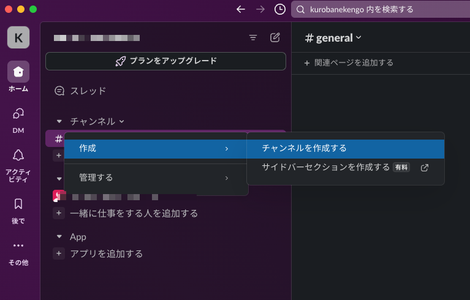

### チャンネル名を入力する

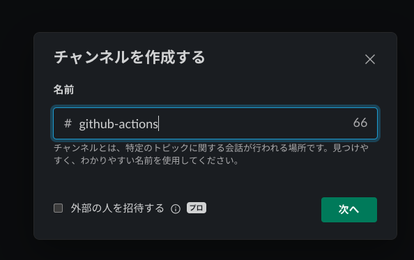

### 「作成」ボタンをクリックする

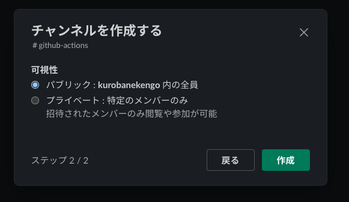

## APIキーの取得

Slack通知に使用するためのWebhook URLを取得する

### 画面左下のアイコンを右クリックする

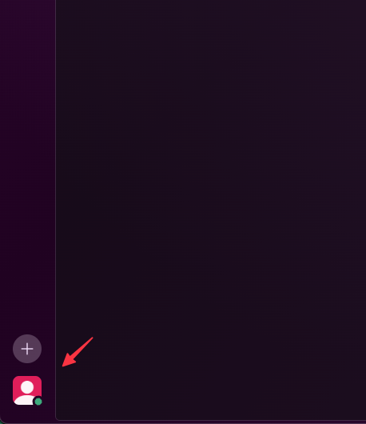

### 「環境設定」をクリックする

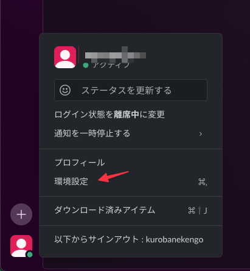

### 「連携アカウント」」メニューを開き「アプリ管理ページ」をクリックする

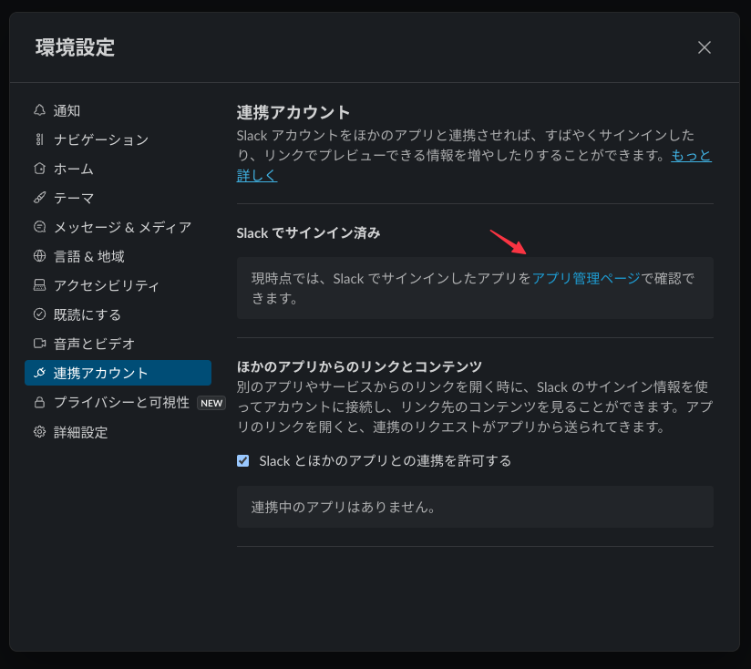

### 検索ボックスより「incoming webhook」を選択する

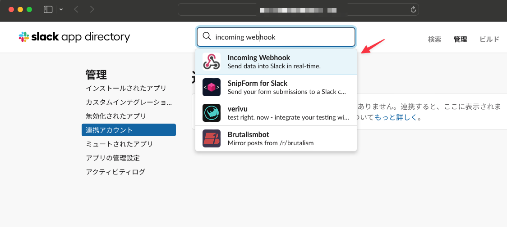

### 「Slackに追加」ボタンをクリックする

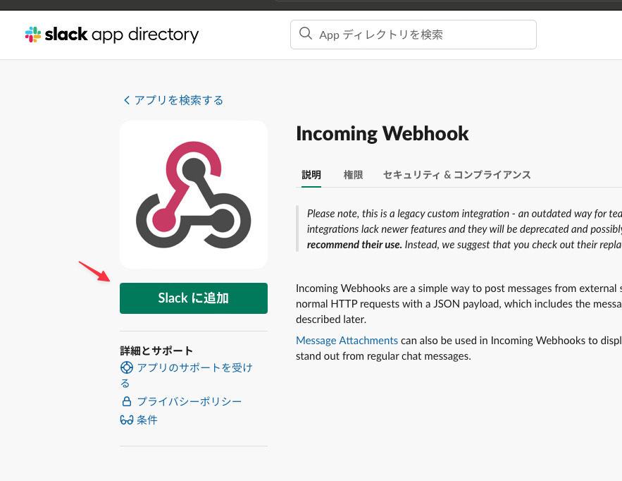

### 通知対象のチャンネル名を選択し「Incoming Webhook インテグレーションの追加」ボタンをクリックする

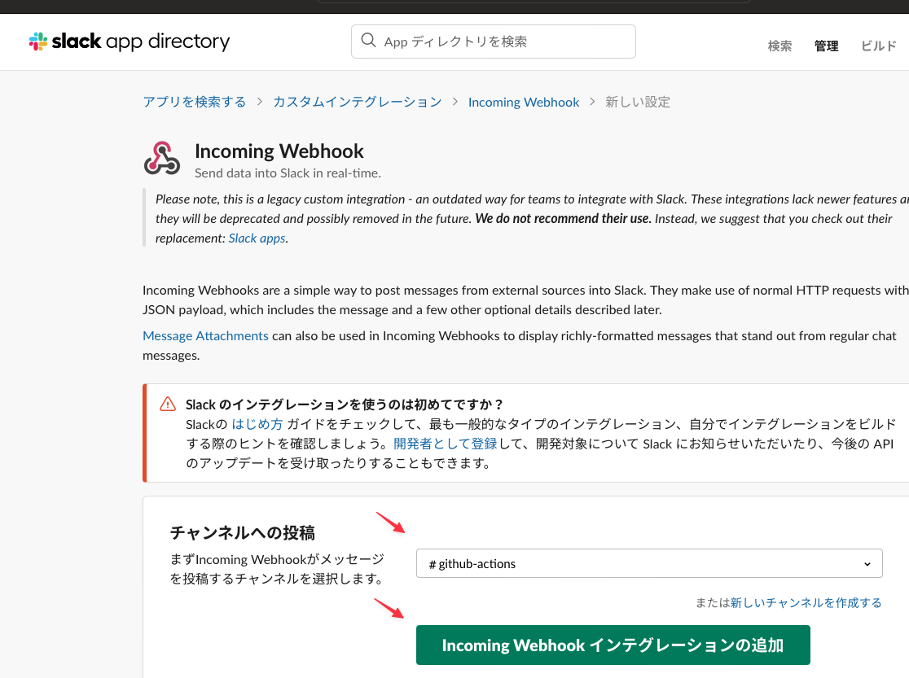

### Webhook URLを控えておく

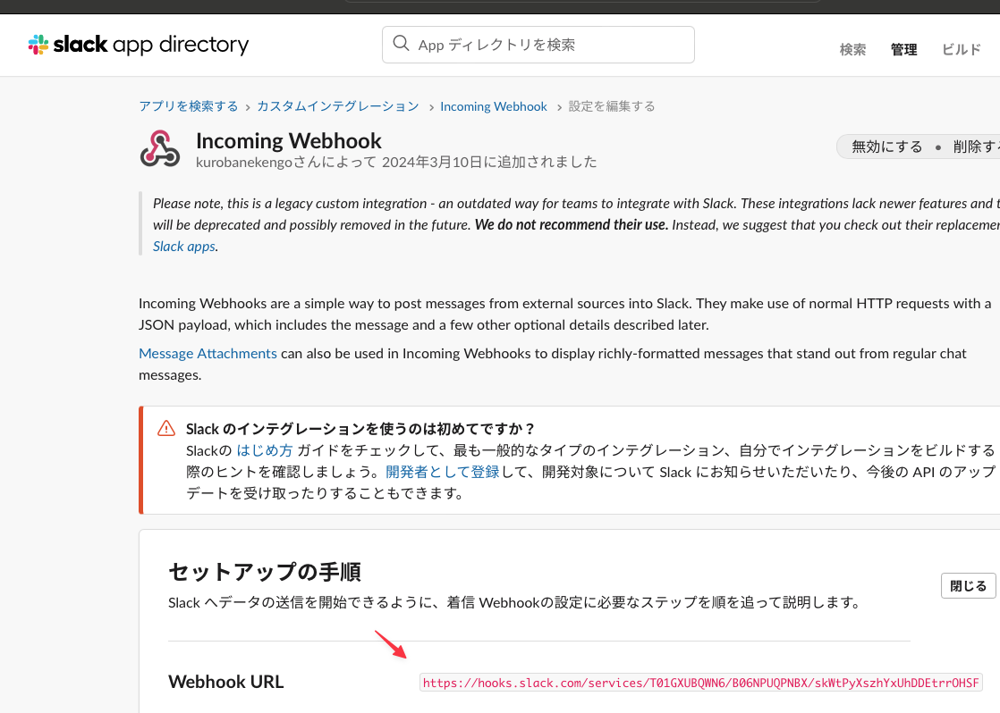

## Githubリポジトリのシークレットを登録

上記で取得したWebhook URLをシークレットとして登録する(ソースコードに機密情報をハードコードするのを防ぐため)

- リポジトリを開き「Settings」メニューをクリックする
- 左メニューの「Secrets and variables」- 「Actinos」をクリックする
- 「New repository secret」をクリックする
- `SLACK_WEBHOOK`という名称で取得したWebhook URLを登録する

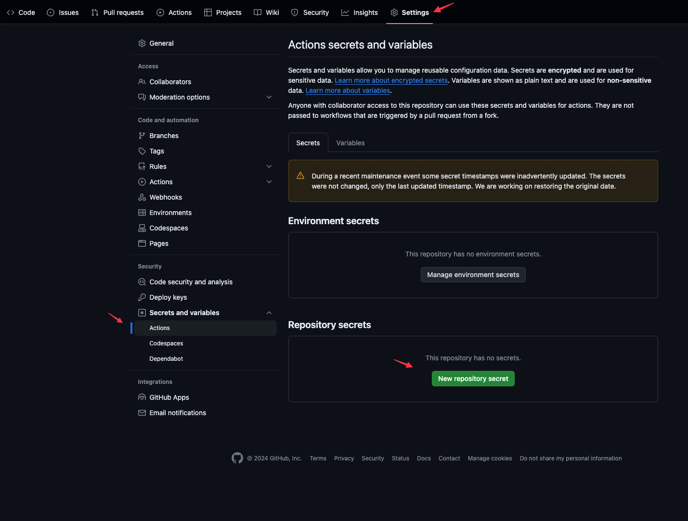

## GitHub Actionsの開発

### 開発用ブランチのチェックアウト

```
$ git checkout -b feature/ci-workflow
Switched to a new branch 'feature/ci-workflow'
```

以降でsample-webapp(フロントエンド)の単体テストを自動実行する仕組みを構築する

### ローカルで単体テストを実行してみる

```
$ yarn test:unit
yarn run v1.22.19
$ vue-cli-service test:unit
 FAIL  tests/unit/example.spec.js
  HelloWorld.vue
    ✕ renders props.msg when passed (30 ms)

  ● HelloWorld.vue › renders props.msg when passed

    expect(received).toMatch(expected)

    Expected substring: "new message"
    Received string:    "This application is Sample WebApp for CICD lesson.Response from REST API is..."

       8 |       props: { msg }
       9 |     })
    > 10 |     expect(wrapper.text()).toMatch(msg)
         |                            ^
      11 |   })
      12 | })
      13 |

      at Object.<anonymous> (tests/unit/example.spec.js:10:28)
      at TestScheduler.scheduleTests (node_modules/@jest/core/build/TestScheduler.js:333:13)
      at runJest (node_modules/@jest/core/build/runJest.js:404:19)
      at _run10000 (node_modules/@jest/core/build/cli/index.js:320:7)
      at runCLI (node_modules/@jest/core/build/cli/index.js:173:3)

Test Suites: 1 failed, 1 total
Tests:       1 failed, 1 total
Snapshots:   0 total
Time:        0.498 s, estimated 1 s
Ran all test suites.
error Command failed with exit code 1.
info Visit https://yarnpkg.com/en/docs/cli/run for documentation about this command.
```

テストに失敗したが失敗するワークフローを確認したいためひとまずこのまま進める。

### GitHub Actions用のワークフローを作成する

下記のファイルを作成

```
${project_root}/.github/workflows/ci-workflow.yml
```

※ファイル名は任意

### ワークフローの実装

下記の内容でワークフローを作成しPUSHする

```
name: CI flow for Amazon ECS

on: [push]

env:
  SLACK_WEBHOOK: ${{ secrets.SLACK_WEBHOOK }}

jobs:
  ci:
    name: ci
    runs-on: ubuntu-latest
    timeout-minutes: 10

    steps:
    - name: Checkout
      uses: actions/checkout@v2

    - name: Unit Test
      run: cd ${{ github.workspace }}
    - run: cd sample-webapp && npm install && npm run test:unit

    - name: Suucess
      uses: rtCamp/action-slack-notify@v2.0.2
      if: success()
      env:
        SLACK_TITLE: CI flow / success
        SLACK_COLOR: good
        SLACK_MESSAGE: Message for success

    - name: Failure
      uses: rtCamp/action-slack-notify@v2.0.2
      if: failure()
      env:
        SLACK_TITLE: CI flow / failure
        SLACK_COLOR: danger
        SLACK_MESSAGE: Message for failure

    
    - name: Cancel
      uses: rtCamp/action-slack-notify@v2.0.2
      if: cancelled()
      env:
        SLACK_TITLE: CI flow / cancel
        SLACK_COLOR: danger
        SLACK_MESSAGE: Message for cancel
```

### ワークフロー実行結果を確認する

作成したワークフローファイルをコミット、PUSHしワークフローを起動する

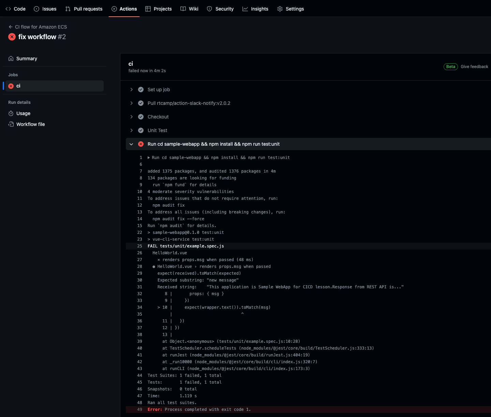

ローカルで実行した時と同じエラーで失敗していることが確認できた。

### テストコードを修正し再度コミット、PUSHしワークフローを起動する

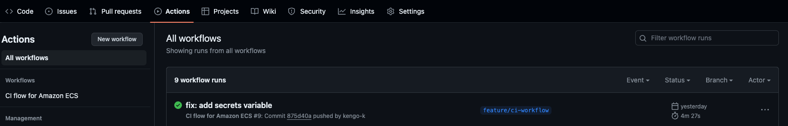

→ ワークフローが正常に終了したことを確認

### Slackに通知されていることを確認する

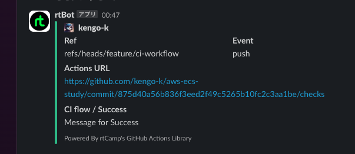