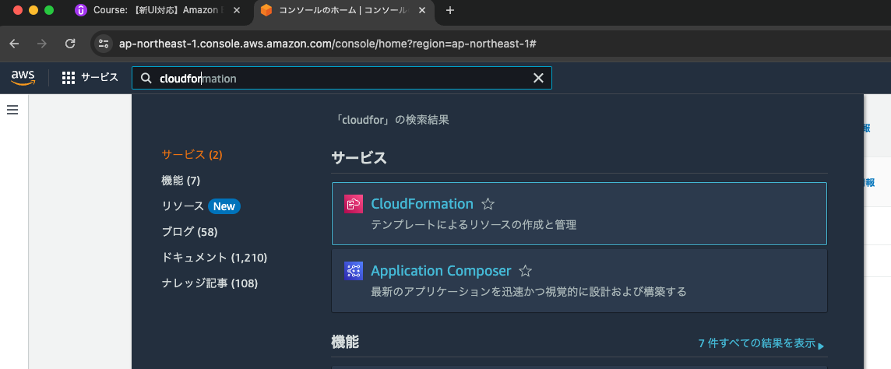
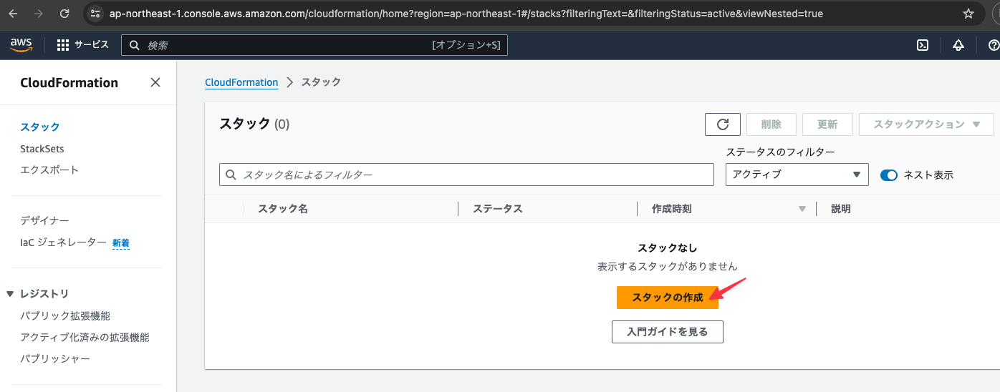
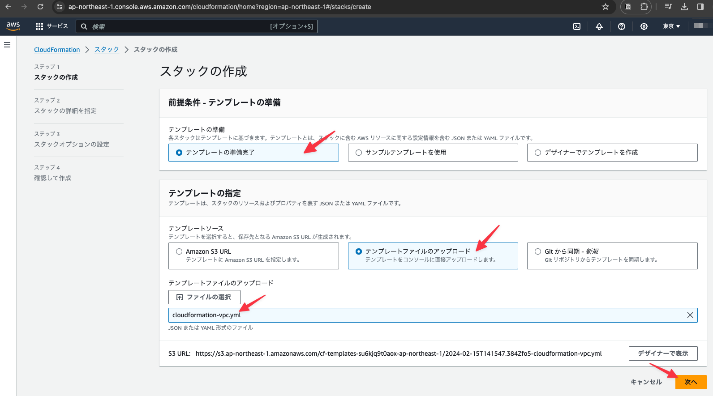
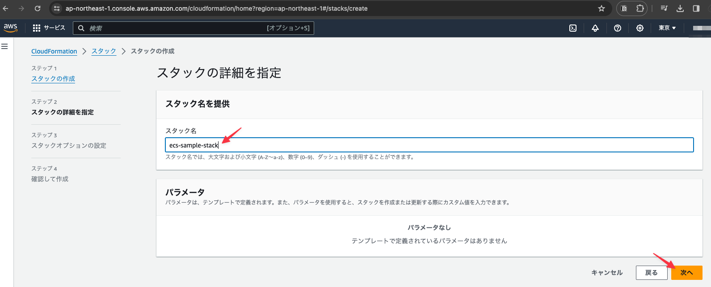
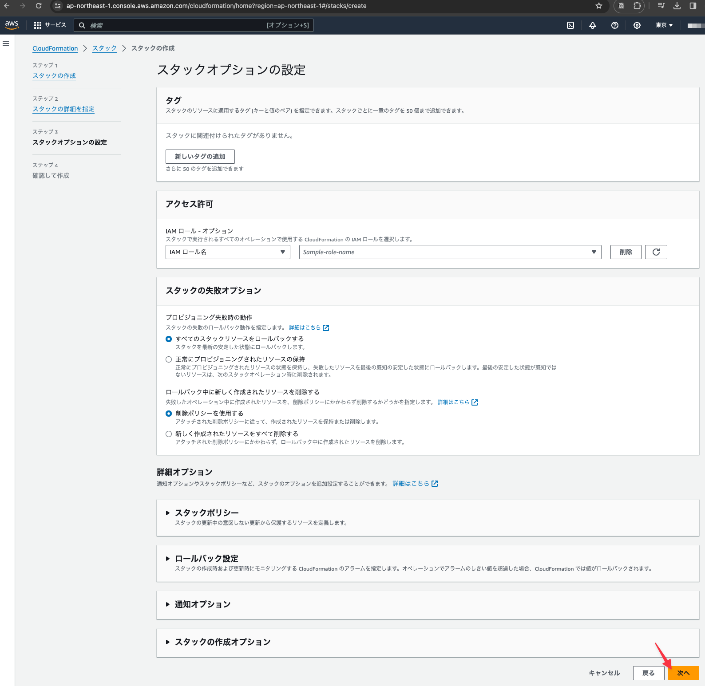
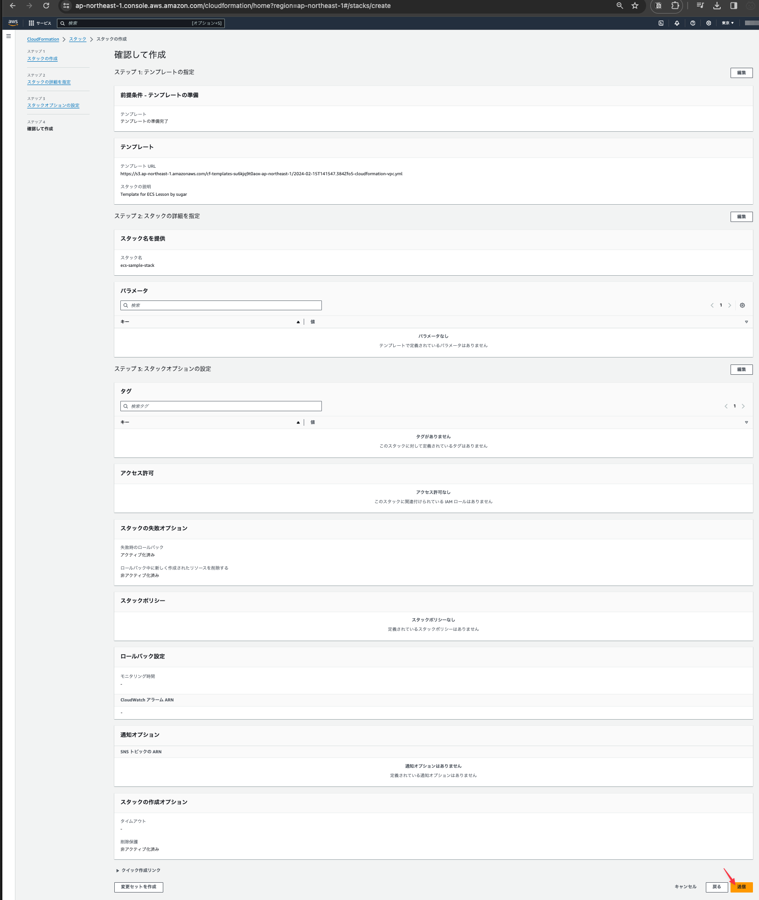
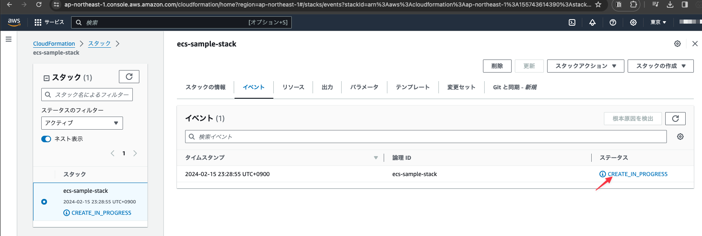
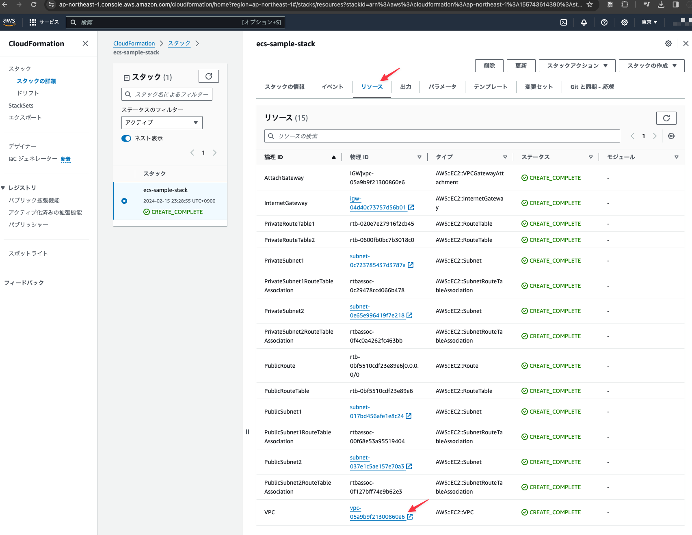
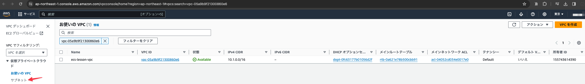
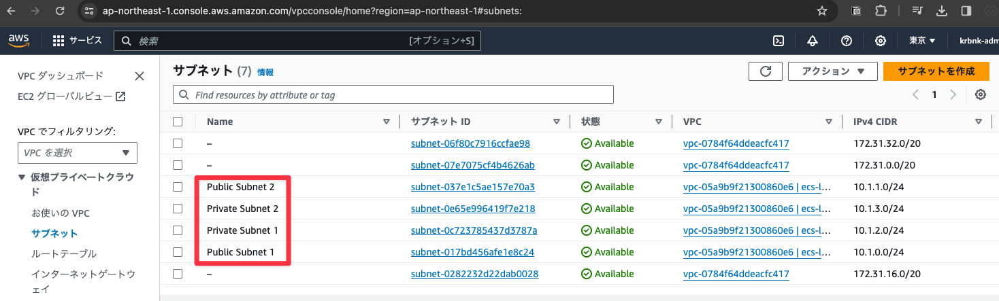

# VPCリソースの作成

Cloudformationの設定ファイルを使用してVPCのリソースを作成する

## サービス名からCloudFormationを検索する

## 初期状態では何も作成されていないので「スタックの作成」ボタンをクリックする

## 設定ファイルを使用してスタックを作成する

下記画像の設定に従い設定ファイルをアップロードする。

## 任意のスタック名を設定し「次へ」ボタンをクリック

## 何も変更せずにそのまま「次へ」ボタンをクリックする

## さらに何も変更せずに「送信」ボタンをクリックする

## スタックが作成されるがステータスが`CREATE_IN_PROGRESS`となっているためしばらく時間を置く(2〜3分程度)

## (しばらく時間を置いた後)「リソース」タブを開いて全てのリソースが`CREATE_COMPLETE`になっていることを確認し、「VPC」のリンクをクリックする

## 左メニューにある「サブネット」をクリックする

## CloudFormationの設定ファイルに記述されているサブネットが作成されていることを確認する

下記画像の赤線部で囲われている4つが設定ファイルによって作成されたサブネットとなる。

※Nameが「-」となっているサブネットは今回使用した設定ファイルで作られたものではないデフォルトで存在しているもの